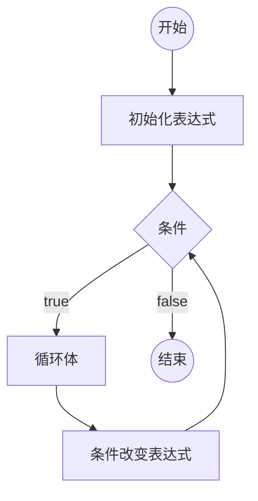

# JS基础

[TOC]

## 概述

### JS语言简史

1. JS语言的起源

   - 网景（Netsape Communication Corperation），1994，推出第一款商用浏览器，网景浏览器（Netsacpe Navigator）
   - 1995年，网景公司决定在浏览器中加入一门语言，可以作为交互效果，提高用户体验
   - 最终决定独立开发一门新语言，聘请==**Brendan Eich**==，10天后，新的语言诞生
   - LiveScript --> JavaScript

2. 第一次浏览器大战

   - 网景公司打算在浏览器中加入网络操作系统，影响到微软的利益，引起了微软的利益
   - 1995年，微软发布IE浏览器，宣告第一次浏览器大战开始
   - JS语言推出之后，网景获得巨大的竞争优势。
   - 微软对JS语言反编译，借鉴JS语言推出了JScript，VBScript
   - 第一次浏览器大战是标准之争
   - ==**1997年，网景公司将JavaScript1.1版本提交到ECMA（欧洲计算机制造协会）**==
   - IE3发布，并绑定windows操作系统
   - 1998年，网景公司，被收购
   - **ECMA收录了JavaScript，并提交给ISO，经过修改，成为了第一个JS的标准版本，成为ECMAScript，简称ES**

3. 第二次浏览器大战

   - IE4、IE5、IE6（window xp）

   - 微软决定解散浏览器团队

   - Brendan Eich，带领团队成立Mozilla基金会，并决定，将网景浏览器开源

   - 长时间内，世界的技术爱好者，对网景浏览器，进行维护和打补丁

   - 2002年，Mozilla推出firefox浏览器

   - 2008年，谷歌推出chrome浏览器，苹果推出safari，ASA公司推出opera

   - chrome浏览器打在JS执行引擎V8（V8引擎，可以将JS代码直接转换为字节码，理论上，JS代码的执行速度接近汇编语言） 

   - 于是JS具备了编写大型应用程序的能力，甚至服务器应用

   - > Ryan Dasl，准备写一个服务器端框架，直接用V8引擎完成了该框架，该框架称为NodeJs

4. ES标准的发展

   - ES1，1997年
   - ES2，1998年
   - ES3，1999年
   - ES5，2009年，习惯上，不再区分javaScript和ECMAScript
   - ES6，2015年，ECMA宣布，从ES6开始，使用年号作为版本号，ES6真正称呼为ES2015
   - ES7，2016年

   ==**非常重要，ES语言标准，不涉及语言的运行环境，正是因为ES避免了运行环境，就让ES有机会在各种环境中执行，ES成为了通用编程语言**==

   **通常，把ES运行的环境称之为，宿主环境**

### JS语言特性

- 解释型语言

  - 编译型语言：C语言、C++、java语言、C#语言

    编译型语言会经过一个翻译的过程，负责翻译的叫做编译器，翻译的结果，叫做编译结果

    优点：执行速度快

    缺点：某个编译结果，难以适用于各种环境（跨平台障碍）；部署繁琐

  - 解释型语言：js、php

    解释型语言没有编译结果

    优点：跨平台，部署简单

    缺点：执行速度稍慢

- 弱类型语言

  - 弱类型：存放的数据类型可变

    优点：灵活、易上手、

    缺点：不严谨

  - 强类型：存放的数据类型不可变

    优点：严谨

    缺点：不灵活、不易上手
    
> 通常，将弱类型的解释型语言，称为脚本语言

- 单线程

  单线程：上一件事情没有做完，下一件事情必须等待

- 异步

  提高单线程的执行效率

## JS语法基础

### 第一个JS程序

#### 概述

1. 浏览器环境中，代码书写位置
   - 直接书写到页面的script元素内部
   - 书写到外部的js文件，在页面中引用（推荐）
2. 代码分离：内容、样式、功能三者相分离，更容易代码维护和阅读
3. 页面中，可以存在多个script元素，执行顺序从上到下
4. 如果一个script元素引用了外部文件，内部不能书写任何代码
5. script有一个可选的属性，type，该属性用于指定代码的类型，该属性值是MIME格式

#### 认识基本语法

1. 语法部分必须都是英文符号
2. js代码由多条语句构成，每个语句用英文分号结束（并非强制要求）
3. js代码从上到下同步执行
4. js语言大小写敏感

#### 认识输出语句

所有的输出语句都不是ES6标准

- `document.write`，该语句用于将数据输出到页面
- `alert`，该语句用于将数据用弹窗的形式显示到页面
- `console.log`，该语句用于将数据显示到控制台

#### 认识输入语句

所有的输入语句都不是ES标准

- `prompt()`

#### 认识注释

注释：提供给代码阅读者使用，不会参与执行

- 单行注释，//，vscode快捷键，`ctrl+ /`
- 多行注释，/**/，`alt + shift + a`

---

### 数据和数据类型

- **数据**：有用的信息

- **数据类型**：数据的分类

#### JS中的数据类型

1. 原始类型

   原始类型指不可再细分的类型

   - 数字类型 number

     数字类型可以加上前缀，来表示不同的进制

     - 0：表示8进制
     - 0x：表示16进制
     - 0b：表示2进制

   - 字符串类型 string

     - 在字符串中，如何表示一个特殊字符，可以使用转义符（\）

   - 布尔类型 boolean

   - undefined类型 

   - null类型

   > 区分长数字与字符串：如果按照数字的方式阅读，则使用数字类型；否则使用字符串类型

2. 引用类型

   - 对象 Object
   - 函数

3. 得到数据类型

   在数据前面加上`typeof`

4. 字面量：直接书写的具体的数据

---

### 变量

1. 什么是变量？

   变量是一块内存空间，用于保存数据

   - 计算机：CPU、内存、硬盘、输入输出设备
   - 内存：存取速度快，数据易丢失
   - 硬盘：存取速度慢，数据永久保存
   - 计算机程序的运行：仅与内存打交道

2. 如何使用变量？

   - 声明（定义）变量，`var 变量名;`
   - 变量赋值：向变量的内存空间中存放数据，`变量名 = 'aaaaaaaa'`

3. JS中存在变量提升

   所有变量的声明，会自动的提到代码的最顶部

   但是这种提升，不会超越脚本块

   同名变量，提升后会变成一个

---

### 变量和对象

1. 通过变量，读取对象中的某个属性，`变量名.属性名`

   - **当读取的属性不存在时，会得到undefined**
   - **当读取属性的对象不存在时（undefined 或 null）时，程序报错**

2. 通过变量，更改对象中的某个属性

   - **当赋值的属性不存在时，会添加属性**

3. 删除属性，`delete 变量名.属性名`

4. 特殊的属性读取方式

   给属性赋值，或读取属性时，可以使用下面格式操作

   ```javascript
   变量名[属性名]; // 读取
   变量名[属性名] = 'aaaa'; // 赋值
   ```

   **属性的名字只能是字符串，如果书写的是数字，会自动转换为字符串**

---

### 全局对象

JS大部分的宿主环境，都会提供一个特殊的对象，该对象可以直接在JS代码中访问，该对象叫做全局对象

在浏览器环境中，全局对象为`window`，表示整个窗口

全局对象中的所有属性，可以直接使用，而不需要写上全局对象名

**开发者定义的所有变量，实际上，会成为window对象的属性**

**如果变量没有被赋值，则该变量不会覆盖window对象上的同名属性**

---

### 引用类型

1. 原始类型的变量，存放的具体的值

2. 引用类型的变量，存放的是内存地址

3. JS中的垃圾回收

   垃圾回收器，会定期发现内存中无法访问到的对象，该对象称之为垃圾，垃圾回收器会在合适的时间将其占用的内存释放

## 运算符

### 运算符概述

1. 操作符和操作数

   操作符： 运算符，参与运算的符号

   操作数： 参与运算的数据，也称之为"元"

   操作符不一定只有一个符号

   操作符出现在不同的位置，可能具有不同的含义	

2. 分类

   按操作数数量区分

   - 一元运算符
   - 二元运算符
   - 三元运算符

   功能区分

   - 算数运算符
   - 比较运算符
   - 逻辑运算符
   - 位运算符
   - 其他

3. 表达式

   **表达式：**操作符与操作数组成的语句的一部分

   - 每个表达式都有一个运算结果，该结果叫做**返回值**，返回值的类型叫做**返回类型**
   - 所有的表达式都可以当成数据使用

   目前学习的运算符的返回值和类型

   - `=`，返回赋值的结果
   - `.`，属性访问表达式，返回的是属性的值
   - `[]`，属性访问表达式，返回的是属性的值
   - `()`，函数调用表达式，返回的结果取决于函数的运行
   - 如果是一个声明+赋值的表达式，返回结果为`undefined`

> chrome浏览器控制台的环境是REPL环境，REPL （Read - Eval - Print - Loop）；当直接在控制台书写代码时，除了运行代码之外，还会输出该表达式的返回值

### 算数运算符

1. 数字运算符是不精确的
2. 除数为0
   - 如果被除数为正数，则得到的结果 Infinity （正无穷）
   - 如果被除数为负数，则得到的结果 -Infinity（负无穷）
   - 如果被除数为0，则得到的结果为 NAN（Not a Number）

### 其他类型使用算数运算符

1. 除加号之外的算数运算符

   将原始类型转换为数字类型（自动完成转换），然后进行运算

   - boolean：true --> 1，false--> 0

   - string：如果字符串内部是一个正确的数字，直接变为数字；如果是一个非数字，则的发哦NAN（能识别infinity，不能把字符串内部的东西当做表达式）；如果字符串是一个空字符串（没有任何内容），转换为0；字符串转换时，会忽略前后的空格

     > NAN 虽然是数字，但是它和任何数字做任何运算得到的结果都是NAN

   - null：null --> 0

   - undefined：undefined --> 1

   - 对象：先转换为字符串类型，再转换为数字类型

2. 加号运算符

   - 加号一边有字符串，含义变为字符串拼接

     将另一边的其他类型，转换为字符串

     - 数字：数字字符串
     - boolean：boolean字符串
     - null：null字符串，“null”
     - undefined： undefined字符串，’undefined‘
     - 对象：[object Object]

     加号两边都没有字符串，但一边有对象，将对象转换为字符串，然后按照上面的规则进行k
     

### 自增和自减

1. `++`：将某个变量的值自增1

2. `--`：将某个变量的值自减1

3. 自增自减表示式

   `x++`：将变量自增1，得到的表达式的值是自增之前的值

   `++x`：将变量自增1，得到表达式的值是自增之后的值

   `x++`：将变量自减1，得到的表达式的值是自增之前的值

   `++x`：将变量自减1，得到表达式的值是自增之后的值

4. 优先级

   - `++、--`
   - `*、/、%`
   - `+、-`

5. 优先级的运算细节

   - 从左到右依次查看
   - 如果遇到操作数，将数据的值直接取出
   - 如果遇到两个相邻的两个运算符，并且左边的运算符优先级大于等于右边的运算符，则直接运行左边的运算符

### 比较运算符

1. 大小比较：`>、<、>=、<+`

2. 相等比较：`==、!=、===、!==`

3. **比较运算符的返回类型：`boolean` **

4. **算数运算符的==优先级==高于比较运算符**

5. 大小比较

   - 两个字符串比较大小，比较的是字符串的字符编码
   - 如果一个不是字符串，并且两个都是原始类型，将它们都转换为数字进行比较
   - 如果其中一个是对象，将对象转换为原始类型后，按照规则1或规则2进行比较
   - NAN与任何数字比较，得到的结果都是`false`
   - Infinity比任何数字都大，-Infinity比任何数字都小

6. 相等比较

   **== 与 !==**

   - 两端的类型相同，直接比较两个数据本身是否相同（两个对象比较的是地址）
   - 两端的类型不同：
     - `null` 和 `undefined`，它们之间相等，和其他原始类型比较，则不相等
     - 其他原始类型，比较时先转换为数字，再进行比较
     - 引用类型比较时，要先转换为原始类型，再进行比较

   `=== 与 !==`

   - 两端类型相同，规则和相等比较一致
   - 两端类型不同，为`false`

   **数字规则**

   - NAN与任何数字比较，都是`false`，包括自身
   - `Infinity`与`-Infinity`，只能和自身相等

### 逻辑运算符

1. 与（&&）

   书写方式：表达式1 && 表达式2

   - 将表达式1，进行 `boolean` 判定
   - 如果表达式1的判定结果为假，则直接返回表达式1，而不执行表达式2；否则，返回表达式2的结果
   - 以下数据均判定为`false`，其他数据全部位置
     - null
     - undefined
     - false
     - ''
     - 0
     - NAN

2. 或（||）

   书写方式：表达式1 || 表达式2

   - 将表达式1进行 `boolean` 判定
   - 如果表达式1为 真，直接返回表达1，而不执行表达式2；否则，返回表达式2；

3. 非（!）

   将数据的`boolean`判定结果直接取反，非运算符一定返回`boolean`类型

### 三目运算符

书写方式：表达式1 ？ 表达式2 : 表达式3;

- 对表达式1进行`boolean`判定
- 如果判定结果为真，返回表达式2,；否则，返回表达式3

### void运算符

书写方式：

- `void 表达式`（优先级过高，容易造成混乱）
- `void(表达式)`(推荐)

作用：运行表达式，返回`undefined`

### 逗号表达式

书写方式：表达式1, 表达式2

作用：依次运行两个表达式，返回表达式2

逗号运算符的优先级，比赋值运算符低

### 数据的存储

1. JS中的小数运算是精确的吗？

   ​	不一定

2. 为什么JS的小数运算不精确？

   十进制的小数，转换为二进制后，可能是无限小数，但是计算机对数字的存储能力有限，因此会丢失一些数据

   ```
   0.3 --> 
   
   0.3 * 2   0.6  0
   0.6 * 2   1.2  1
   0.2 * 2   0.4  0
   0.4 * 2   0.8  0
   0.8 * 2   1.6  1
   ...
   ```

3. JS的整数运算是精确的吗？

   不一定

4. JS中表示的整数是连续的吗？

   不是，当JS数字很大时，不再连续

5. JS中表示的最大数字是多少？

   最大连续整数：MAX_SAFE_INTERGER

6. JS中能表示的数字的有效位数是多少？

   16 ~ 17

7. JS如何存储数字？

   标准有整数法、浮点法；但是在JS中，存储的所有数字，都按照浮点法存放。

   浮点法存放的数字，叫做浮点数（float），浮点数分为单精度和双精度

   JS中，使用双精度存放浮点数，IEEE 754

8. JS中数字存放方式？

   JS在计算机中，给每个数字开辟一块内存空间，尺寸固定为64位

   **一个正常的数字，指数部分最多只能是2046**

   安全数字：从1开始到该数字，均是连续的整数，并且该数字的下一个整数时存在的

   ```
   64位：[第一段][第二段][第三段]
   	 第一段：1位，表示符号位，如果为1，是负数，如果为0，则为正数
   	 第二段：11位，表示指数位，这里的指数是2为底的指数，而不是10；为表示负数次幂，应减去1023
   	 第三段：52位，表示有效数字；表示尾数位（小数位）
   	 
   0 100000000011 1111000000000....
   相当于：1.1111（应转换为10进制）* 2 (1027 - 1023)
   
   特殊情况：
   1. 指数为0，尾数为0，表示数字0
   2. 符号位0，指数为2047，尾数为0，表示正无穷
   3. 符号位1，指数为2047，尾数为0，表示负无穷
   4. 指数为2047，尾数不为0，表示NAN
   ```

   > 在计算机中，位（bit）是最小的存储单位
   >
   > 1 byte = 8 bit
   >
   > 1 KB = 1024 byte
   >
   > 1 MB = 1024 KB
   >
   > 1 GB = 1024 MB

9. 进制转换

   二进制  -->  十进制

   - 1101  --> $1 * 2^3 + 1 * 2^2 + 0 * 2^1 + 1 * 2^0 = 13$
   - 11.01 -->  $1 * 2^1 + 1 * 2^0 + 0 * 2^(-1) + 1 * 2^(-2) = 3.25$

   十进制 --> 二进制

   13 --> 1101

   ```
   13 / 2 商 6 余 1
   6 / 2  商 3 余 0 
   3 / 2  商 1 余 1
   1 / 2  商 0 余 1
   余数从下往上看
   ```

   3.25 --> 11.01

   ```
   整数部分一样
   
   小数部分
    0.25 * 2    0.5    整数部分 0
    0.5 * 2     1.0    整数部分 1
    整数部分从上往下看
   ```

10. **结论**

    - 在对精度要求很高的系统中，或要对小数的运算结果进行比较时，需要特别谨慎

### 位运算

1. 位运算：将一个整数的二进制格式进行运算

2. JS中，如果对一个数据进行位运算，它首先会将其转换为一个整数，并且按照32位的整数二进制拍排列，第一位为符号位，0表示正数，1表示负数

   NAN --> 0，Infinity --> 0，-Infinity --> 0

3. 与运算

   符号：&

   书写方式：整数1 & 整数2

   将两个整数每一位进行比较，如果都为1，结果为1，否则结果为0；

4. 或运算

    符号：|

   书写方式：整数1 | 整数2

   将两个整数每一位进行比较，如果都为0，结果为0，否则结果为1；

5. 否运算

   符号：~

   书写方式：~整数

   将该整数按位取反，取反的快速运算 `~数字 = -数字 - 1`

   **JS中，快速取整：~~数据**

6. 异或运算

   符号：^

   书写方式：数字1 ^ 数字2

   将数字1和数字2按位比较，不同取1，相同取0

7. 位移运算

   左位移：<<

   书写方式：数字1 << 数字2，结果：数字1 * 2^数字2

   将数字1的二进制（除符号位之外，左移动数字2的次数）

   右位移：>>

   书写方式：数字1 >> 数字2，结果：整数（数字1 / 2^数字2）

   全右位移：>>>

   与右位移的区别，在于全右位移会导致符号位跟着位移

8. 负数的存储方式

```
-1
真码：1000 0000 0000 0000 0000 0000 0000 0001
反码：1111 1111 1111 1111 1111 1111 1111 1110 真码取反
补码：1111 1111 1111 1111 1111 1111 1111 1111 反码加1，最终的-1存储方案
```

### 求余和求模

1. 求余

   ```
   x rem y : x - n * y , n表示商取整（直接去掉小数，向0取整）
   ```

   余数和被除数的符号相同

2. 求模

   ```
   x mod y: x - n * y, n 表示商取整（向下取整）
   ```

   求模的符号与除数相同

## 流程控制

### if判断

### switch

### 循环

#### while循环

#### do-while循环

#### for循环



#### 循环中的关键字

- break
- continue

### 数组

数组用于存放多个数据

1. 创建一个数组

   - `new Array(长度)`
     - 长度，数组里面的数据总数，长度一定是一个非负数
   - `new Array(数据, 数据, ...)`
     - 创建一个数组，并且初始化其每一项的值
   - `[数据, 数据, ...]`
     - 创建一个数据，并初始化其每一项的值

2. 数组的本质

   数组的本质是一个对象

   - `length`：数组的长度，会自动变化，值为最大下标加1
   - 数字字符串属性：叫做下标，也叫做索引，相当于数组中每个数据的编号，下标从0开始
     - 连续下标取值范围为：0 ~ length-1，如果给length赋值，	会可能导致数组被截断
     - 实际开发中，不要length赋值
     - 下标不连续的数组，叫做稀松数组

3. 添加数组项

   - `数组[长度] = 数据`：向数组末尾添加一个数据
   - `数组.push(数据)`：想数据末尾添加一个数据
   - `数组.unshift(数据)`：向数组起始位置添加一个数据，会导致数组每一项的下标向后移动
   - `数组.splice(下标, 0, 添加的数据)`：从指定下标位置开始，删除0个，然后在该位置插入添加的数据，如果下标超过范围则按照范围的边界进行处理
   - push、unshift、splice可以添加多个数据

4. 删除数据

   - `delete 数组[下标]`：这种做法不会导致数组其他的属性发生变化，如length属性等不会发生变化，因此该做法会产生稀松数组，所以不推荐使用该做法
   - `数组.pop()`：删除数组的最后一项，该表达式返回最后一项的数据
   - `数组.shift()`：删除数组第一项，该表达式返回数组的第一项数据
   - `数组.splice(下标, 删除的数量, 添加的数据)`：从指定下标位置开始，删除指定数量，探后在该位置插入添加的数据；返回一个新数组，该数组记录被删除的数据

5. 其他操作

   - `数组.slice(骑士位置, 结束位置下标)`：将起始位置到结束位置之间的数据拿出来，得到一个新数组，该函数不会改变原数组；注意：结束下标取不到

   - 清空数组：
     - `数组.splice(0, 数组.length)`
     - `数组.length = 0`
   - 查找数组中某一项的下标
     - `数组.indexOf(数据)`：从数组中依次查找对应的数据，查找时使用严格相等进行比较，找到第一个匹配的下标并返回
   
6. in关键字

   判断某个属性在对象中是否存在

   `属性名 in 对象`

7. for-in循环

   ```javascript
   for(var prop in obj) {
       // 循环体
   }
   ```

   取出对象所有的属性名，每次循环将其中一个属性名赋值给变量prop，运行循环体
   

## 函数

重复代码：让程序难以维护

函数主要用于减少重读代码

### 函数语法

1. 创建（声明、定义）函数

   ```javascript
   function 函数名() {
       // 函数体
   }
   ```

   函数体的代码不会直接运行，必须手动调用函数，才能运行其中的代码

2. 调用函数

   `函数名()`

3. 函数提升

   通过字面量声明的函数，会提升到脚本块顶部

   通过字面量声明的函数，会成为全局函数的属性 

4. 其他特点

   - 通过`typeof`函数名，得到的结果是`function`
   - 函数内部声明的变量：
     - 如果不适用`var`声明，和全局变量一致，表示给全局对象添加属性
     - 如果适用`var`声明，变量提升到所在函数的顶部，函数外部不能使用该变量
     - **函数中声明的变量，仅能在函数内部使用，在外部无效**
   
5. 参数

   - 表示函数运行的未知条件，需要调用者告知的数据
   - 如果没有传实参，则对应的形参为undefined

   ```javascript
   // 参数的有效范围在函数体中
   function 函数名(参数1, 参数2, ...) {
       // 函数体
   }
   
   函数名(实参)
   ```

6. 返回值

   - 函数运行后，得到的结果:调用函数时，调用表达式的值就是函数的返回值
   - `return`会直接结束整个函数的运行
   - `return`后面如果不跟任何数据，返回`undefined`
   - 如果函数没有书写`return`，则该函数会在末尾自动`return undefined`

7. 文档注释

   ```javascript
   /**
   * 两数求和
   * @param {number} a 第一个数字
   * @param {number} b 第二个数字
   * @returns {mumber} 相加的结果
   */
   function sum(a, b) {
       return a + b;
   }
   ```

### 作用域和闭包

#### 作用域

作用域表示一个代码区域，也表示一个运行环境

1. JS中，有两种作用域
   - 全局作用域：直接在脚本中书写的代码
     - 在函数作用域中声明的变量，会被提升到脚本块的顶部，并且会成为全局对象的属性
   - 函数作用域：函数中的代码
     - 在函数作用域中声明的变量，会被提升到函数的顶部，并且不会成为全局对象的属性，因此，函数中声明的变量不会导致全局对象的污染
     - 当函数成为一个表达式时，它既不会提升，也不会污染全局对象
       - 将函数变为一个函数表达式的方式之一，是将函数用小括号括起来，然而，使用该方法后，函数无法通过名称调用
       - 如果书写一个函数表达式，然后立即调用，该函数称之为立即执行函数 IIFE
       - 在大部分情况下，函数表达式的函数名没有实际意义，因此，可以省略函数名
       - 没有名字的函数，称之为匿名函数
2. 作用域中可以使用的变量
   - 全局作用域中能使用全局作用域中声明的变量（包括函数）
   - 函数作用域中，不仅能够使用自身作用域中声明的变量（包括函数），还能使用==外部环境==的变量
   - 有时候，某个函数比较复杂，在编写的过程，可能需要另外一些函数来辅助它完成一些功能，而这些函数仅仅会被该函数使用，不会在其他位置使用，则可以将这些函数声明到该函数的内部
   - 函数内部声明的变量和外部冲突时，使用内部的

#### 闭包

闭包（closure）,是一种现象，内部函数，可以使用外部函数环境中的变量	

### 函数表达式和this

#### 函数表达式

在JS中，函数也是一个数据，语法上，函数可以用于任何需要数据的地方

JS中，函数是一等公民

函数是一个引用类型，将其赋值给某个变量时，变量中保存的是函数的地址

#### this

1. 在全局作用域中，`this`关键字固定指向全局对象
2. 在函数作用域中，取决于函数是如何被调用的
   - 函数直接调用，`this`指向全局对象
   - 通过一个对象的属性调用，`this`指向该对象

### 构造函数

1. 用于创建对象的函数

   - 函数返回一个对象
   - 构造函数，`new 函数名(参数)`
     - 函数名使用大驼峰命名法
     - 构造函数内部，会自动创建一个新对象，`this`指向新创建的对象，并且自动返回新对象
     - 构造函数中，如果出现返回值，如果返回的是原始类型，则忽略；如果返回的是引用类型，则使用返回的结果
     - 所有的对象，最终都是通过构造函数创建的

2. `new.target`

   该表达式在函数中使用，返回的是当前的构造函数，但是如果该函数不是通过`new`调用的，则返回`undefined`

   通常用于判断某个函数是否通过`new`调用

### 函数的本质

函数的本质就是对象

> 某些教程中，将构造函数称之为构造器

所有的函数，都是通过`new Function`创建的

由于函数本身就是对象，因此函数中，可以拥有各种属性

#### 包装类

- JS为了增强原始类型的功能，为`boolean、string、number`分别创建了一个构造函数
- 如果语法上，将原始类型当做对象使用时(一般是在使用属性时)，JS会自动在该位置用对应的构造函数，创建对象来访问原始类型的属性

> 成员属性（方法）、实例属性（方法）：表示该属性是通过构造函数创建的对象调用的
>
> 静态属性（方法）、类属性（方法）：表示该属性是通过构造函数本身调用的

### 递归

递归：函数直接或间接调用自身

无限递归，会导致执行栈溢出

对比死循环

- 死循环不会报错，也不会导致栈溢出
- 无限递归会导致栈溢出

1. 执行栈

   - 任何代码的执行都必须有一个执行环境，执行环境为代码的执行提供支持
   - 执行环境是放到执行栈中
   - 每个函数调用，都需要创建一个函数执行环境，函数调用结束，执行环境销毁
   - 执行栈有相对固定的大小，如果执行环境太多，执行栈无法容纳，会报错
   
2. 尾递归

   如果一个函数，最后一条语句是调用函数，并且调用函数不是表达式的一部分，则该语句称为尾调用，如果是尾调用是调用自身函数，则称为尾递归

   某些语言或执行环境会对尾调用进行优化，它们会直接销毁当前函数，避免执行栈空间被占用

   在浏览器执行环境中，尾调用没有优化；但在nodejs环境中有优化

## 标准库

### Object 

1. 静态成员

   - `keys(某个对象)`，得到某个对象的所有属性名数组
   - `values(某个对象)`，得到某个对象的所有属性值数组
   - `entries(某个对象)`，得到某个对象的所有属性名和属性值的数组

2. 实例成员

   > 实例成员可以重写

   **所有对象，都拥有Object的所有实例成员**

   - `toString()`，得到某个对象的字符串格式
   - `valueOf()`，得到某个对象的值，默认情况下，返回该对象本身

     > 在JS中，当自动的进行类型转换时，如果要对一个对象进行转换，实际上是先调用对象的valueOf方法，然后调用返回结果的toString方法，将得到的结果进行进一步转换
     >
     > 如果抵用valueOF已经得到了原始类型，则不再调用toString 

### Function

**所有函数都具有Function中的实例成员**

1. **arguments**

   - 在函数中使用，获取该函数调用时，传递的所有参数
   - arguments是一个类数组（也称为伪数组：没有通过Array构造函数创建的类于数组结构的对象），类数组会缺少大量的数组实例方法
   - arguments数组中的值，会与对应的形参映射

2. 实例成员

   - `length`属性：得到函数形参的数量

   - `apply`方法：调用函数，同时指定函数中的`this`指向，参数以数组传递

   - `call`方法：调用函数，同时指定函数中的`this`指向，参数以列表传递

     - 通常，可以调用`apply、call`方法，将某个伪数组转换为真数组

       `var arr = Array.prototype.slice.call(likeArray)`

   - `bind`方法：得到一个新函数，该函数中的`this`始终指向指定的值

### Array

凡是通过Array构造函数创建的对象，都是数组

1. 静态成员

   - `from`方法：可以将类数组装换为真数组
   - `isArray`方法：判断一个给定的数据是否为一个真数组
   - `of`方法:根据一组参数来创建新的数组实例，支持任意的参数数量和类型

2. 实例成员

   - `fill`方法：用某个数据填充数组
   - `pop`
   - `push`
   - `reverse`：将当前数组颠倒顺序
   - `shift`
   - `sort`：对数组进行排序
   - `splice`
   - `unshift`

   以下方法不改变原数组

   - `concat`
   - `includes`
   - `join`
   - `slice`
   - `indexOf`
   - `lastIndexOf`

   迭代方法

   - `forEach`
   - `every`
   - `some`
   - `filter`
   - `map`
   - `reduce`
   - `find`
   - `findIndex`

### 原始类型包装器

- `new 包装器(值)`：返回的是一个对象
- `包装器(值)`：返回的是一个原始类型

#### Number

1. 静态成员

- `isNaN`

- `isFinite`

- `isInterger`

- `parseFloat`：将一个数据装换为小数

- `parseInt`：将一个数据转换为整数，直接舍去小数

  - `parseInt、parseFloat`，要求参数是一个字符串，如果不是字符串，则会先转换为字符串

    从字符串开始位置进行查找，找到第一个有效的数字进行转换，如果没有找到，则返回NAN,左右空白字符会忽略

  - `parseInt`：可以传入第二个参数，表示将给定的字符串，识别为多少进制

2. 实例成员

- `tofixed`方法：会有四舍五入
- `toPREcision`：以指定的精度返回一个数字字符串

#### Boolean

#### String

1. 静态成员

   - `fromCharCode`方法：通过unicode编码，创建字符串
   
2. 实例成员

   - `length`属性：字符串长度

   > 字符串是一个伪数组

   - `charAt`方法：得到指定位置的字符
   - `charCodeAt`：
   - `concat`
   - `includes`
   - `endWidth`
   - `indexOf`
   - `padStart`：指定字符串长度以及填充字符，若字符串不满足长度，则在字符创头部填充指定字符，直到满足长度；若字符串满足长度，则不对字符串做处理
   - `padEnd`：
   - `repeat`
   - `startWidth`
   - `slice`：从某个位置取到某个位置；位置可以是负数
   - `substr`：从某个位置开始取，取指定的长度；位置可以是负数
   - `substring`：从某个位置取到某个位置；位置不能是负数；负数直接转换为0；参数位置是可调换的
   - `toLowerCase`
   - `toUpperCase`
   - `trim`
   - `split`

### Math对象

提供了一系列与数学相关的成员

> 常量：永远不会变化的数据，常量一般命名时，所有字母大写，如果有多个单词，用下划线分割

- `random`方法：产生一个0~1之间的随机数
- `PI`属性：得到圆周率
- `abs`方法：求绝对值
- `floor`方法：对一个数向下取整
- `ceil`方法：对一个数，向上取整
- `max`方法：得到一组数字的最大值；如果无参，得到 Infinity
- `min`方法：得到一组数字的最小值；如果无参，得到 -Infinity
- `pow`方法：求一个数的幂
- `round`方法：得到一个四舍五入的整数

### Date

1. 时间戳

   1970-1-1 凌晨 至 某个时间，所经过的毫秒数

2. 创建时间对象

   - 直接调用函数（不适用new），忽略所有参数，直接返回当前时间的字符串

   - `new Date`：创建日期对象

     - 无参，得到当前时间

     - 1个参数，参数为数字，表示传入的是时间戳

     - 2个参数及多个参数，分别表示年、月、日、时、分、秒、毫秒；

       - 如果缺失参数，日期部分默认为1，时、分、秒、毫秒默认为0
       - 月、日、时、分、秒、毫秒，可以为负数，如果传递负数，会根据指定日期进行计算

     - **注意：月份的数字从0开始计算**

3. 实例方法

   - `getDate`方法：得到日期部分
   - `getDay`方法：得到星期，0表示星期天
   - `getFullYear`：得到年份
   - `getMonth`：得到月，从0开始计算
   - `getHours`：得到小时部分
   - `getMinutes`：得到分钟部分
   - `getSeconds`：得到秒部分
   - `getMilliSeconds`：得到毫秒部分
   - `getTime`方法：得到时间错
   - `toDateString`方法：将日期部分转换为可读的字符串
   - `toISOString`方法：将整个日期对象转换为ISO标砖的字符串格式
   - `toLocaleDateString`方法：根据当前系统地区设置，将日期部分转换为可读的字符串
   - `toLocaleString`方法：根据当前系统的地区设置，将整个日期对象转换为可读的字符串
   - `toLocaleTimeString`方法：根据当前系统的地区设置，将时间部分转换为可读的字符串

4. 日期的运算

   日期对象重写了Object的valueOf方法，返回时是一个数字，表示时间戳

### 正则表达式

正则表达式是国际标准，跨越语言

正则表达式是一个规则，用于验证字符串

#### 基础

1. 字面量匹配

   规则中直接书写字面量字符

2. 特殊字符

   - `.`
   - `^`
   - `$`

3. 转义符

   ```javascript
   \r
   \n
   \t
   \s
   \S
   \b
   \B
   \d
   \D
   \w
   \W
   \u
   ```

   转义符可以将特殊字符转义

4. 字符集

   - `[字符范围]`：如[a-e]、[a-z]、[A-Z]、[abc]
   - `[^字符范围]`：对字符范围取反
   - 匹配中文：[\u4e00-\u9FA5]
   
5. 量词

   表示前面规则出现的次数

   - `*`
   - `+`
   - `?`：0个或1个
   - `{n}`：匹配n个
   - `{n,}`：至少匹配n个
   - `{n,m}`；匹配n~m个

6. 或者

   多个规则之间，适用好或者`|`，表示多个规则任选其一

#### JS中的应用

#### 进阶

1. 捕获组

   - 用小括号包裹的部分叫做捕获组；捕获组会出现在匹配结果中

   - 捕获组可以命名，叫做具名捕获组

     `var reg = /(?<year>\d{4})-(?<month>\d{1,2})-(?<day>\d{1,2})/g`

   - 非捕获组

     `var reg = (?:\d{4})-(?:\d{1,2})-(?:\d{1,2})`

2. 反向引用

   - 在正则表达式中，使用某个捕获组，`\捕获组编号`或`\k<捕获组名称>`

3. 正向断言（预查）

   - 检查某个字符后面的字符是否满足某个规则，该规则不成为匹配结果，并且不成为捕获组

     `var reg = /[a-zA-Z](?=\d+)/g` 

4. 负向断言（预查）

   - 检查某个字符后面的字符是否不满足某个规则，该规则不成为匹配结果，并且不成为捕获组

     `var reg = /[a-zA-Z](?!\d+)/g`

```javascript
// 检查密码强度
// 要求密码中出现小写字母，大写字母，数字，特殊字符(@!_,.),密码长度为6-12
var reg = /^(?=.*[a-z])(?=.*[A-Z])(?=.*\d)(?=.*[!@#_,.]).{6,12}/g
```

### 错误处理

JS中的错误，大概分为两种：

- 语法错误：会导致整个脚本块无法运行
- 运行错误
  - 运行报错：会导致当前脚本块后面代码无法执行
  - 运行结果不符合预期

1. 调试错误

   - 控制台打印
   - 断点调试

2. 抛出错误

   错误在JS中本质上时一个对象，抛出错误的语法为：`throw  错误对象`

   错误对象的构造函数为Error

3. 捕获错误

   ```javascript
   try {
       // 代码块1
   } catch(错误对象) {
       // 代码块2
   } finally {
       // 代码块3
   }
   ```

## DOM

### web api概述

web Api：浏览器宿主环境中的对象和函数

- 知识繁杂
- 成体系的知识
- 程序思维：知识 + 程序思维 = 应用
- 兼容性：了解，不记忆

1. web Api

   - BOM，Browser Object Model，浏览器对象模型，控制浏览器本身
   - DOM，Document Object Model，文档对象模型，控制HTML

2. web Api 由于 W3C 制定

3. DOM

   - DOM 0
   - DOMM 1
   - DOM 2
   - DOM 3
   - DOM 4，2015年

4. DOM是什么？

   DOM核心理念，是将一个HTML或XML文档，用对象模式表示，每个对象称之为DOM对象；

   DOM对象又称为节点（Node）

   节点的类型

   - `DocumentType`：文档类型节点
   - `Document`：文档节点，表示整个文档
   - `Comment`：注释节点
   - `Element`：元素节点
   - `Text`：文本节点
   - `Attribute`：属性节点
   - `DocumentFragment`：文档碎片节点

   DOM树：文档中不同的节点形成的树形结构

### 获取DOM节点

> 全局对象 window 中有属性document，代表的是整个文档节点

1. 旧的获取元素节点的方式

   DOM 0 

   - `document.body`：获取body元素节点
   - `document.head`：获取head元素节点
   - `document.links`：获取页面上所有的超链接节点
   - `document.anchors`：获取页面上所有的额锚链接(具有name属性)元素节点
   - `document.forms`：获取页面中所有的form元素节点
   
2. 新的获取元素节点的方式

   **通过方法获取**

   - `document.getElementById`：通过id获取对应id的元素
   - `document.getElementsByTagName`：通过元素名称获取元素
   - `document.getElementsByClassName`：通过类样式获取元素，IE9以下无效
   - `document.getElementsByName`：通过元素的name属性值获取元素
   - `document.querySelector`：通过css选择器获取元素，得到匹配的第一个，IE8以下无效
   - `document.querySelectorAll`：通过css选择器获取元素，得到所有匹配的结果，IE8以下无效
   - `document.documentElement`：获取根元素

   **细节**

   - 在所有的得到类数组的方法中，除了querySelectorAll，其他的方法都是实时更新的
   - getElementById得到元素执行效率最高
   - 书写id的元素，会自动成为window对象的属性，它是实时的单对象；不推荐使用
   - getElementsByTagName、getElementsByClassName、querySelector、querySelectorAll可以作为其他元素节点对象的方法使用

   **根据节点关系获取节点**

   - `parentNode`：获取父节点，父元素
   - `previousSibling`：获取上一个兄弟元素
   - `nextSibling`
   - `childNodes`：获取所有子节点
   - `firstChild`
   - `lastChild`
- `attributes`：获取某个元素的属性节点
  

**获取元素节点**

   - `previousElementSibling`：获取上一个兄弟元素
   - `nextElementSibling`
   - `parentElement`：获取父元素
   - `children`：获取子元素
   - `firstElementChild`：获取第一个子元素
- `lastElementChild`：获取最后一个子元素
  
   **获取节点信息**
   
   - `nodeName`
   - `nodeVaule`
   - `nodeType`
   

### DOM操作

#### 获取和设置元素属性

- 通用方式：getAttribute、setAttribute

1. 正常的HTML属性（特性）

   - `dom对象.属性名`


   **细节**

   - 正常的属性即使没有赋值，也有默认值
   - 布尔属性在dom对象中，得到的是boolean
   - 某些表单元素，可以获取到某些不存在的元素
   - 某些属性名与标致名冲突，此时需要更换属性名，如label的for属性，需要用htmlFor获取，classs属性，使用className

2. 自定义属性

   - HTML5建议自定义属性使用`data-属性名`
   - 如果遵从HTML5自定义属性规范，可以使用`dom对象.dataset.属性名`
   - 删除自定义属性：`removeAttribute('属性名')`或者`delete dom对象.dateset.属性名`

#### 获取和设置元素内容

- `innerHTML`
- `innerText`：获取和设置元素内部的纯文本，仅得到元素内部显示出来的文本
- `textContent`：获取和设置元素背部的纯文本，得到的是内部源代码中的文本

#### 元素结构重构

- `父元素.appendChild(元素)`
- `父元素.insertBefore(待插入的元素, 哪个元素之前)`
- `父元素.replaceChild(替换元素, 被替换元素)`

**细节**

更改元素结构，效率较低，尽量少用

#### 创建和删除元素

1. 创建元素
   - `document.createElement('标签名')`
   - `document.createTextNode('文本')`
   - `document.createDocumentFragment()`
2. 克隆元素
   - `dom对象.cloneNode(是否深度克隆)`：复制一个新的dom对象，并返回
3. 删除元素
   - `父元素.removeChild`：父元素调用，传入子元素
   - `dom对象.remove()`：把自己删除

### DOM元素样式

1. 控制DOM元素的类样式
   - `className`：获取或设置元素的类名
   - `classList`：dom4的新属性，是一个控制元素类名的新属性，IE10以下无效
     - add
     - remove
     - contains
     - toggle
2. 获取样式
   - `dom.style`：得到==行内样式==对象
   - `window.getComptedStyle(dom, 伪元素（若想获取该对象伪元素的样式，否则填null）)`：得到某个元素的最终计算样式
3. 设置样式
   - `dom.style.样式名=值`

## DOM事件

### 概述

1. 术语

   - 事件：发生一件事
   - 事件类型：发生什么事
   - 事件处理程序：一个函数，当某件事情发生时运行
   - 事件注册：将一个事件处理程序，挂载到某个事件上

2. 事件流

   当某个事件发生时，哪些元素会监听到该事件的发生，这些事件元素触发该事件的顺序

   **当一个元素发生了某个事件时，那该元素的所有祖先元素都发生了该事件**

   **事件冒泡**：先触发最里层的元素，然后再依次触发外层元素

   **事件捕获**：先触发外层的元素，然后再依次触发里面的元素

   目前，标准规定，默认情况下，事件是冒牌的方式触发的

   **事件源/事件目标**：事件目标阶段的元素

### 事件注册

1. dom0

   - 将事件名称前加上on，作为dom的属性名，给该属性赋值为一个函数，即为事件注册

     `dom.on事件名 = 事件处理程序`
     
    - 移除：重新给事件属性赋值，通常赋值为null或undefined
   
2. dom2

   - `dom.addEventListener(事件类型, 事件处理程序, 是否在捕获阶段触发)`
   - `dom.removeEventListener(事件类型，事件处理函数)`
     - 事件处理函数不能使用匿名函数
   
   **与dom0的区别**
   
   - dom2可以为某个元素的同一个事件，添加多个处理程序，按照注册的先后顺序运行
   - dom2允许开发者控制事件处理的阶段，使用第三个参数，表示是否在捕获阶段触发
     - 如果元素是目标元素，那么第三个参数无效
   
   **细节**
   
   1. dom2在IE8以下不兼容，需使用attachEvent,detachEvent添加和移除事件
   
   2. 添加和移除事件时，可以将第三个参数写为一个对象，进行相关配置
   
      ```javascript
      {
          capture: true/fasle,
          once: true/false
      }
      ```
### 事件对象

事件对象封装了事件的相关信息

1. 获取事件对象
   - 通过事件处理函数的参数获取
   - 旧版本的IE浏览器通过window.event获取
2. 事件对象的通用成员
   - target & srcElement(IE)：事件目标（事件源）
     - 事件委托：通过给祖先元素注册事件，在事件处理程序中判断事件源进行不同的处理
     - 通常事件委托用于，动态生成元素的区域
   - currentTarget：当前目标，即绑定事件的元素，相当于`this`
   - type：字符串，得到事件类型
   - preventDefault(推荐) & returnValue(IE)：阻止浏览器默认行为
     - 在dom0中方式：在事件处理程序中返回false
     - 针对a元素，可以设置为功能型链接解决跳转问题，`<a href="javascript:void(0);" />`
   - stopPropagation：阻止事件冒泡
   - eventPhase：得到事件所处的阶段
     - 1：事件捕获
     - 2：事件目标
     - 3：事件冒泡

### 鼠标事件

1. 事件类型

   - `click`：用户点击鼠标按钮（一般左键）或按下在聚焦时按下回车键触发
   - `dblclick`：用户双击主鼠标按键触发（频率取决于系统设置）
   - `mousedown`：用户按下鼠标任意按键时触发
   - `mouseup`：用户抬起鼠标任意按键时触发
   - `mousemove`：鼠标在元素上移动时触发
   - `mouseover`：鼠标在进入元素时触发
   - `mouseout`：鼠标离开元素时触发
   - `mouseenter`：鼠标进入元素时触发，该事件不会冒泡
   - `mouseleave`：鼠标离开元素时触发，该事件不会冒泡

   **区别**

   - over与out：不考虑子元素，从父元素移动到子元素，对于父元素而言，仍然算作离开
   - enter与leave：考虑子元素，子元素任然是父元素的一部分

2. 事件对象

   所有鼠标事件，事件处理程序中的事件对象都为MouseEvent

   - `altKey`：触发事件时，是否按下了alt键

   - `ctrlKey`

   - `shiftKey`

   - `button`：触发事件时，鼠标按键类型

     - 0：左键
     - 1：中键
     - 2：右键

     **位置相关**

   - `page`：pageX、pageY，表示当前鼠标距离页面的横纵坐标

   - `client`：clientX、clientY，鼠标相对于视口的坐标

   - `offset`：offsetX、offsetY，鼠标相对于==事件源==的==内边距==的坐标

   - `screen`：screenX、screenY，鼠标相对于屏幕

   - `x、y`：等同于clientX、clientY

   - `movement`：movementX、movementY，只在鼠标移动事件中有效，相对于上一次鼠标位置偏移的距离

### 键盘事件

1. 事件类型

   - `keydown`：按下键盘上任意键触发，如果按住不放，会重复触发此事件
   - `keypress`：按下键盘上一个==字符键==时触发
   - `keyup`：抬起键盘上任意按键触发

   keydown、keypress，如果阻止了事件默认行为，文本不会显示

2. 事件对象

   - `code`：得到按键字符串，能够适配键盘布局
   - `key`：得到键盘字符串，不适配键盘布局。能得到打印字符

### 其他事件

1. 表单事件
   - `focus`：元素聚焦时触发（能与用户发生交互作用的元素，都可以聚焦），该事件不会冒泡
   - `blur`：元素失去焦时触发，该事件不会冒泡
   - `submit`：提交表单事件，仅在form元素有效
   - `change`：文本改变事件
   - `input`：文本改变事件，即时触发
2. 页面状态事件
   - `window.load`：页面中所有资源全部加载完毕事件
   - `document.DOMContentLoaded`：dom树构建完成之后触发，只能使用addEventListener
   - `readyState`属性
     - loading
     - interative：会触发DOMContentLoaded事件
     - complete：会触发window的load事件
   - `readystatechange`：状态发生改变时触发
3. 其他
   - `beforeunload`：window的事件，关闭窗口时运行，可以阻止关闭窗口
   - `unload`：window事件，关闭窗口时运行
   - `scroll`：窗口发生滚动时触发
     - 通过scrollTop和scrollLeft，可以设置和获取滚动距离
   - `resize`：window事件，窗口尺寸改变时触发，监听的是视口尺寸
   - `contextmenu`
   - `paste`
   - `copy`
   - `cut`

### 元素位置

- `offsetParent`：获取某个元素第一个定位的祖先元素，如果没有，则得到body；body的offsetParent为null
- `offsetLeft、offsetTop`：相对于该元素的offsetparent的坐标；如果offsetParent 是body，则将其当做是整个网页
- `getBoundingClientRect`方法：该方法得到一个对象，该对象记录了该元素相对于视口的距离

### 事件模拟

- `click`
- `submit`
- `dispatchEvent`

### 其他补充

## BOM

### 计时器

1. 计时器是异步的，当时机成熟之后才会执行
2. 计时器会返回一个数字，该数字表示计时器的编号
3. 计时器方法
   - `setTimeout`
   - `clearTimeout`
   - `setInterval`
   - `clearInterval`

```javascript
function interval(callback, duration) {
    setTimeout(function() {
        callback();
        interval(callback, duration);
    }, duration);
}
```

### window对象

1. 自身方法
   - `open`
   - `alert`
   - `confirm`
   - `prompt`
2. 对象属性
   - `document`
   - `location`
     - `href`属性：得到目前地址
     - `reload`方法：刷新当前页面
   - `navigator`
   - `history`
     - `go`
     - `back`
     - `forward`
   - `console`
     - `log`：打印对象valueOf返回值
     - `dir`：打印对象结构
     - `time & timeEnd`：用于计时

## 进阶

### 原型

1. **所有函数都有一个属性：`prototype`，称之为函数原型**
2. 默认情况下，prototype是一个普通的Object对象
3. 默认情况下，prototype中有一个属性：constructor，它也是一个对象，它指向构造函数本身
4. 隐式原型 `__proto__`
   - 所有的对象都有一个属性：`__proto__`，称之为隐式原型
   - 默认情况下，隐式原型指向创建该对象的函数的原型
   - 当访问一个对象成员时：
     - 看该对象自身是否拥有该成员，如果有直接使用
     - 看该对象的隐式原型是否拥有该成员，如果有直接使用
     - 在原型链中依次查找
5. 猴子补丁：在函数原型中加入成员，以增强对象的功能，猴子补丁会导致原型污染，使用需谨慎

### 原型链

1. Function的`__proto__`指向自身的原型
2. Object 的隐式原型指向null

### 原型链的应用

1. 基础方法

   **W3C不推荐直接使用系统成员`__proto__`**

   - `Object.getPrototypeOf(对象)`：获取对象的隐式原型
   - `Object.prototype.isPrototypeOf(对象)`：判断当前对象是否在指定对象的原型链上
   - `对象 instanceof 函数`：判断函数的原型是否在对象的原型链上
   - ``Object.create(对象)`：创建一个新对象，其隐式原型指向指定对象
   - `Object.prototype.hasOwnProperty(属性名)`：判断一个对象==自身==是否拥有某个属性

2. 应用

   - 类数组转换为真数组

     `Array.prototype.slice.call(类数组)`

   - 实现继承

     ```javascript
     var inherit = (function() {
         var F = function() {};
         return function(son, father) {
             F.prototype = father.prototype;
             son.prototype = new F();
             son.prototype.constructor = son;
             son.prototype.uber = father.prototype;
         }
     })();
     
     function inherit(son, father) {
         son.prototype = Object.create(father.prototype);
         son.prototype.constructor = son;
         // son..prototype.uber = father.prototype;
         son.prototype.uber = father;
     }
     ```

### 属性描述符

它表达了一个属性的相关信息（元数据），它本质是一个对象

1. 数据属性
2. 存取属性
   - 当给它赋值，会自动运行一个函数，`set`
   - 当获取它的值时，会自动运行一个函数，`get`
3. `Object.getOwnPropertyDescriptor`：获取某个对象的某个属性的属性描述符对象（该属性必须直接属于该对象）

### 执行上下文

**执行上下文**：一个==函数运行==前，创建的一块内存空间，空间中包含该函数执行所需要的数据，为该函数执行提供支持

**执行上下文堆栈**：call stack，所有执行上下文组成的内存空间

**全局执行上下文**：所有js代码执行之前，都必须有该环境

1. JS中始终执行的是栈顶的上下文

2. 执行上下文的内容

   **this指向**

   **VO 变量对象**：记录了该环境中所有声明的参数、变量和函数

   AO(Active Object)：当前正在执行的上下文的VO

   1）创建AO对象；--> 创建执行期上下文；

   2）找形参和变量声明，将变量和形参名作为AO的属性名， 值为undefined；

   3）将形参和实参统一；

   4）在函数体里面找函数声明，值赋予函数体；
   
3. 当一个上下文中的代码执行的时候，如果上下文中不存在某个属性，则会从之前的上下文中查找

### 作用域链

1. vo中包含一个额外的属性，该属性指向创建该VO的函数本身
2. 每个函数在创建时，会有一个隐藏属性`[[scope]]`，它指向==创建==该函数时的AO
3. 当访问一个变量时，会先查找自身VO中是否存在，如果不存在，则依次查找`[[scope]]`属性，
4. 某些浏览器会优化作用域链，仅保留`[[scope]]`中需要用到的属性

### 事件循环

1. 浏览器的线程

   1）JS执行引擎：负责执行代码（单线程）

   2）渲染线程：负责渲染页面

   3）计时器线程：负责计时

   4）事件监听线程：负责监听事件

   5）http网络线程：负责网络通信

2. 事件队列：一块内存空间，用于存放执行时机到达的异步函数；当JS引擎空闲（执行栈没有可执行的上下文），它会从事件队列中拿出第一个事件执行

3. 事件循环：event loop，是指函数在执行栈、宿主线程、事件队列中的循环移动。


   

   


