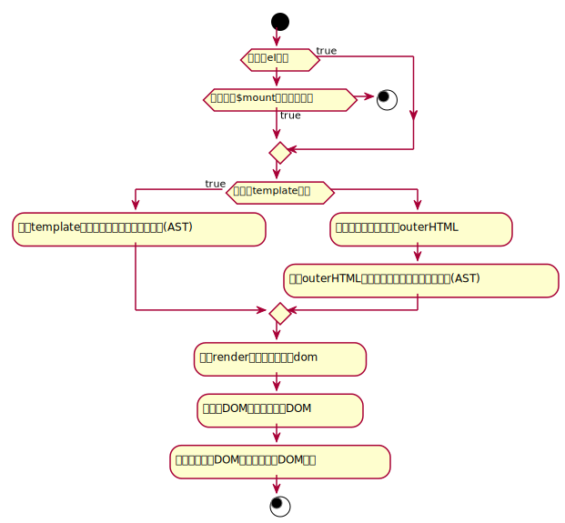

# VUE全家桶

[TOC]

## 概述

1. 为什么要使用VUE?

   - 性能更好
   - 视图、数据分离
   - 维护成本低

2. VUE性能好在哪里？

   VUE的核心是虚拟DOM，使用虚拟DOM可以减少DOM操作，从而提升应用性能

3. 什么会影响web英勇的性能？==（待补充）==

   - 操作DOM影响性能，因为操作DOM十分昂贵
     - JS 与 DOM是两种东西，每次连接需要消耗性能
     - 操作 DOM 会导致重排与重绘

4. 什么时候触发重排？

   - 添加或删除==可见的 DOM 元素==
   - 元素位置改变
   - 元素尺寸改变（外边距、内边距、边框宽度、宽度、高度）
   - 内容改变，如文本改变或图片别另一个不同尺寸的图片代替
   - 页面渲染器初始化
   - 浏览器窗口尺寸改变

   [各CSS属性对重排重绘的影响](https://csstriggers.com/)

5. 什么是虚拟DOM?

   虚拟DOM(virtual dom)，是一个伪DOM，是由JS来模拟出的具有真实DOM结构的一个树形结构
   
6. 为什么要使用JS来模拟DOM结构？

   - 在前端的三种语言（HTML, CSS, JS）中，只有JS是一种编程语言，只有JS能做到判断、循环、递归、能够实现各种逻辑、实现各种算法
   - DOM的操作是昂贵的，js的运行效率更高，将DOM对比放在js层，减少DOM操作，效率更高

7. [虚拟DOM库——snabbdom](https://github.com/snabbdom/snabbdom)

8. 什么是VUE?

   - 渐进式的MVVM框架
     - M：model，数据
     - V：view，视图
     - VM：viewModel

## 创建一个vue实例

1. 插值表达式：`{{  }}}`

   ```javascript
   {{ 'a' }}
   {{ 1 }}
   {{ true }}
   {{ [123] }}
   {{ {a: 1, b: 2} }} // 填写对象时，要与插值表达式用空格分开
   {{ 1+1 }} //2
   {{ 1-2 }}  // -1
   
   {{ var a = 10; return a; }} // 语法错误，不能填写js语句
   {{  if(true) {return 'a'} }} // 语法错误
   
   {{ !true ? 'a' : 'b' }} // 'b'
   
   {{ name }} // 'xiexie'
   {{ desc }} // 'weiwei'
   
   <script>
   	const vm = new Vue({
       	el: '#app',
       	data: {
               name: 'xiexie',
               desc: 'weiwei'
           }
   	});    
   </script>
   ```

2. 数据使用和数据绑定

   - 使用数据时，需要在data中先存在
   - 数据要先存在，才能实现绑定

3. 监测数组改变

   - 通过索引的方式改变数组，==不能==渲染视图
   - 通过数组长度的改变的方式去改变数组，==不能==渲染视图
   - 通过数组变异方法的方式改变数组，能渲染视图
     - `push`、`pop`、`shift`、`unshift`、`sort`、`reverse`、`splice`
   - 通过`Vue.set()`与`vm.$set()`的方式改变数组，也==能==渲染视图
     - `Vue.set(vm.arr, indexOfArr, newValue)`
     - `vm.$set(vm.arr, indexOfArr, newValue)`

4. 监测对象改变

   - Vue不能检测到对象属性的添加或删除，即==不能==渲染视图
   - 通过`Vue.set()`与`vm.$set()`的方式添加属性，==能==渲染视图
     - `Vue.set(vm.obj, propertyName, value)`
     - `vm.$set(vm.obj, propertyName, value)`
   - 也可以使用`Object.assign()`与`_extend()_`为对象添加一次性添加多个属性，==能==渲染视图
     - `vm.obj = Object.assign({}, vm.obj, { //多个键值对 })`

5. ==vue重新渲染视图的过程是异步的==

   ```javascript
   const vm = new Vue({
       el: '#app',
       data: {
           name: 'xiexie',
           desc: 'weiwei'
       }
   });    
   
   // vue重新渲染视图是异步的
   vm.name = 'xiaoguli';
   vm.desc = 'naer';
   
   console.log(vm.$el.innerText); // xiexie weiwei
   
   vm.$nextTick(() => { // 在vue渲染页面之后执行
       console.log(vm.$el.innerText); // xiaoguli nuer
   });
   
   ```

6. `Vue.nextTick()`或 `vm.$nextTick()`：在下次 DOM 更新循环结束之后执行延迟回调。在修改数据之后立即使用这个方法，获取更新后的 DOM

7. `vm.$mount()`：挂载 DOM 元素

8. 在`data`中`this`指向window，在`methods`中`this`指向vue实例；在组件中，`data`和`methods`中的`this`均指向组件实例

## vue指令

1. `v-pre`：跳过这个元素和它的子元素的编译过程。可以用来显示原始模板标签。**跳过大量没有指令的节点会加快编译**。

   ```html
   <span v-pre>{{ this will not be compiled }}</span> // {{ this will not be compiled }}
   ```

2. `v-cloak`：这个指令**保持在元素上直到关联实例结束编译**。和 CSS 规则如 `[v-cloak] { display: none }` 一起用时，这个指令可以隐藏未编译的 Mustache 标签直到实例准备完毕。

   ```css
   [v-cloak] {
     display: none;
   }
   ```

   ```html
   <div v-cloak>
     {{ message }}
   </div>
   <!-- 不会显示，直到编译结束 -->
   ```

3. `v-once`：只渲染元素和组件**一次**。随后的重新渲染，元素/组件及其所有的子节点将被视为静态内容并跳过。这可以用于优化更新性能

   ```html
   <!-- 单个元素 -->
   <span v-once>This will never change: {{msg}}</span>
   <!-- 有子元素 -->
   <div v-once>
     <h1>comment</h1>
     <p>{{msg}}</p>
   </div>
   <!-- 组件 -->
   <my-component v-once :comment="msg"></my-component>
   <!-- `v-for` 指令-->
   <ul>
     <li v-for="i in list" v-once>{{i}}</li>
   </ul>
   ```

4. `v-html`：更新元素的 `innerHTML` 。**注意：内容按普通 HTML 插入 - 不会作为 Vue 模板进行编译** 。如果试图使用 `v-html` 组合模板，可以重新考虑是否通过使用组件来替代

   > 在网站上动态渲染任意 HTML 是非常危险的，因为容易导致 [XSS 攻击](https://en.wikipedia.org/wiki/Cross-site_scripting)。只在可信内容上使用 `v-html`，**永不**用在用户提交的内容上。

   ```html
   <div v-html="html"></div>
   ```

5. `v-text`：更新元素的 `textContent`。如果要更新部分的 `textContent` ，需要使用 `{{ Mustache }}` 插值。很少使用，一般适应插值语句

6. `v-if、v-else、v-else-if`：根据表达式的值的真假条件渲染元素。在切换时元素及它的数据绑定 / 组件被销毁并重建。如果元素是 `<template>` ，将提出它的内容作为条件块。

   当条件变化时该指令触发过渡效果。

   当和 `v-if` 一起使用时，`v-for` 的优先级比 `v-if` 更高。

7. `v-show`：根据表达式之真假值，切换元素的 `display` CSS 属性。不支持`<template>`

   当条件变化时该指令触发过渡效果。

8. `v-bind`：

   - **编写**：`:`

   - **预期**：`any (with argument) | Object (without argument)`

   - **参数**：`attrOrProp (optional)`

   - **修饰符**：

     - `.prop` - 被用于绑定 DOM 属性 (property)。([差别在哪里？](https://stackoverflow.com/questions/6003819/properties-and-attributes-in-html#answer-6004028))
     - `.camel` - (2.1.0+) 将 kebab-case 特性名转换为 camelCase. (从 2.1.0 开始支持)
     - `.sync` (2.3.0+) 语法糖，会扩展成一个更新父组件绑定值的 `v-on` 侦听器。

   - **用法**：

     动态地绑定一个或多个特性，或一个组件 prop 到表达式。

     在绑定 `class` 或 `style` 特性时，支持其它类型的值，如数组或对象。

     在绑定 prop 时，prop 必须在子组件中声明。可以用修饰符指定不同的绑定类型。

     没有参数时，可以绑定到一个包含键值对的对象。注意此时 `class` 和 `style` 绑定不支持数组和对象。

   - **示例**：

     ```html
     <!-- 绑定一个属性 -->
     
     
     <!-- 动态特性名 (2.6.0+) -->
     <button v-bind:[key]="value"></button>
     
     <!-- 缩写 -->
     
     
     <!-- 动态特性名缩写 (2.6.0+) -->
     <button :[key]="value"></button>
     
     <!-- 内联字符串拼接 -->
     
     
     <!-- class 绑定 -->
     <div :class="{ red: isRed }"></div>
     <div :class="[classA, classB]"></div>
     <div :class="[classA, { classB: isB, classC: isC }]">
     
     <!-- style 绑定 -->
     <div :style="{ fontSize: size + 'px' }"></div>
     <div :style="[styleObjectA, styleObjectB]"></div>
     
     <!-- 绑定一个有属性的对象 -->
     <div v-bind="{ id: someProp, 'other-attr': otherProp }"></div>
     
     <!-- 通过 prop 修饰符绑定 DOM 属性 -->
     <div v-bind:text-content.prop="text"></div>
     
     <!-- prop 绑定。“prop”必须在 my-component 中声明。-->
     <my-component :prop="someThing"></my-component>
     
     <!-- 通过 $props 将父组件的 props 一起传给子组件 -->
     <child-component v-bind="$props"></child-component>
     
     <!-- XLink -->
     <svg><a :xlink:special="foo"></a></svg>
     ```

     `.camel` 修饰符允许在使用 DOM 模板时将 `v-bind` 属性名称驼峰化，例如 SVG 的 `viewBox` 属性：

     ```html
     <svg :view-box.camel="viewBox"></svg>
     ```

     在使用字符串模板或通过 `vue-loader`/`vueify` 编译时，无需使用 `.camel`。

9. `v-on`

   - **缩写**：`@`

   - **预期**：`Function | Inline Statement | Object`

   - **参数**：`event`

   - **修饰符**：

     - `.stop` - 调用 `event.stopPropagation()`。
     - `.prevent` - 调用 `event.preventDefault()`。
     - `.capture` - 添加事件侦听器时使用 capture 模式。
     - `.self` - 只当事件是从侦听器绑定的元素本身触发时才触发回调。
     - `.{keyCode | keyAlias}` - 只当事件是从特定键触发时才触发回调。
     - `.native` - 监听组件根元素的原生事件。
     - `.once` - 只触发一次回调。
     - `.left` - (2.2.0) 只当点击鼠标左键时触发。
     - `.right` - (2.2.0) 只当点击鼠标右键时触发。
     - `.middle` - (2.2.0) 只当点击鼠标中键时触发。
     - `.passive` - (2.3.0) 以 `{ passive: true }` 模式添加侦听器

   - **用法**：

     绑定事件监听器。事件类型由参数指定。表达式可以是一个方法的名字或一个内联语句，如果没有修饰符也可以省略。

     用在普通元素上时，只能监听[**原生 DOM 事件**](https://developer.mozilla.org/zh-CN/docs/Web/Events)。用在自定义元素组件上时，也可以监听子组件触发的**自定义事件**。

     在监听原生 DOM 事件时，方法以事件为唯一的参数。如果使用内联语句，语句可以访问一个 `$event` 属性：`v-on:click="handle('ok', $event)"`。

     从 `2.4.0` 开始，`v-on` 同样支持不带参数绑定一个事件/监听器键值对的对象。注意当使用对象语法时，是不支持任何修饰器的。

   - **示例**：

     ```html
     <!-- 方法处理器 -->
     <button v-on:click="doThis"></button>
     
     <!-- 动态事件 (2.6.0+) -->
     <button v-on:[event]="doThis"></button>
     
     <!-- 内联语句 -->
     <button v-on:click="doThat('hello', $event)"></button>
     
     <!-- 缩写 -->
     <button @click="doThis"></button>
     
     <!-- 动态事件缩写 (2.6.0+) -->
     <button @[event]="doThis"></button>
     
     <!-- 停止冒泡 -->
     <button @click.stop="doThis"></button>
     
     <!-- 阻止默认行为 -->
     <button @click.prevent="doThis"></button>
     
     <!-- 阻止默认行为，没有表达式 -->
     <form @submit.prevent></form>
     
     <!--  串联修饰符 -->
     <button @click.stop.prevent="doThis"></button>
     
     <!-- 键修饰符，键别名 -->
     <input @keyup.enter="onEnter">
     
     <!-- 键修饰符，键代码 -->
     <input @keyup.13="onEnter">
     
     <!-- 点击回调只会触发一次 -->
     <button v-on:click.once="doThis"></button>
     
     <!-- 对象语法 (2.4.0+) -->
     <button v-on="{ mousedown: doThis, mouseup: doThat }"></button>
     ```

     在子组件上监听自定义事件 (当子组件触发“my-event”时将调用事件处理器)：

     ```html
     <my-component @my-event="handleThis"></my-component>
     
     <!-- 内联语句 -->
     <my-component @my-event="handleThis(123, $event)"></my-component>
     
     <!-- 组件中的原生事件 -->
     <my-component @click.native="onClick"></my-component>
     ```
   
10. `v-for`

    - **预期**：`Array | Object | number | string | Iterable (2.6 新增)`

    - **用法**：

      基于源数据多次渲染元素或模板块。此指令之值，必须使用特定语法 `alias in expression` ，为当前遍历的元素提供别名：

      ```html
      <div v-for="item in items">
        {{ item.text }}
      </div>
      ```

      另外也可以为数组索引指定别名 (或者用于对象的键)：

      ```html
      <div v-for="(item, index) in items"></div>
      <div v-for="(val, key) in object"></div>
      <div v-for="(val, name, index) in object"></div>
      ```

      `v-for` 默认行为试着不改变整体，而是替换元素。迫使其重新排序的元素，你需要提供一个 `key` 的特殊属性：

      ```html
      <div v-for="item in items" :key="item.id">
        {{ item.text }}
      </div>
      ```

      从 2.6 起，`v-for` 也可以在实现了[可迭代协议](https://developer.mozilla.org/zh-CN/docs/Web/JavaScript/Reference/Iteration_protocols#可迭代协议)的值上使用，包括原生的 `Map` 和 `Set`。不过应该注意的是 Vue 2.x 目前并不支持可响应的 `Map` 和 `Set` 值，所以无法自动探测变更。

      当和 `v-if` 一起使用时，`v-for` 的优先级比 `v-if` 更高。详见[列表渲染教程](https://cn.vuejs.org/v2/guide/list.html#v-for-with-v-if)

11. `v-model`

    - **预期**：随表单控件类型不同而不同。

    - **限制**：

      - `<input>`
      - `<select>`
      - `<textarea>`
      - components

    - **修饰符**：

      - [`.lazy`](https://cn.vuejs.org/v2/guide/forms.html#lazy) - 取代 `input` 监听 `change` 事件
      - [`.number`](https://cn.vuejs.org/v2/guide/forms.html#number) - 输入字符串转为有效的数字
      - [`.trim`](https://cn.vuejs.org/v2/guide/forms.html#trim) - 输入首尾空格过滤

    - **用法**：

      在表单控件或者组件上创建双向绑定。	

    - **参考**：

      - [表单控件绑定](https://cn.vuejs.org/v2/guide/forms.html)
      - [组件 - 在输入组件上使用自定义事件](https://cn.vuejs.org/v2/guide/components-custom-events.html#将原生事件绑定到组件)
    
12. `v-slot`

    - **缩写**：`#`

    - **预期**：可放置在函数参数位置的 JavaScript 表达式 (在[支持的环境下](https://cn.vuejs.org/v2/guide/components-slots.html#解构插槽-Props)可使用解构)。可选，即只需要在为插槽传入 prop 的时候使用。

    - **参数**：插槽名 (可选，默认值是 `default`)

    - **限用于**

      - ` <template> `
      - [组件](https://cn.vuejs.org/v2/guide/components-slots.html#独占默认插槽的缩写语法) (对于一个单独的带 prop 的默认插槽)

    - **用法**：

      提供具名插槽或需要接收 prop 的插槽。

    - **示例**：

      ```html
      <!-- 具名插槽 -->
      <base-layout>
        <template v-slot:header>
          Header content
        </template>
      
        Default slot content
      
        <template v-slot:footer>
          Footer content
        </template>
      </base-layout>
      
      <!-- 接收 prop 的具名插槽 -->
      <infinite-scroll>
        <template v-slot:item="slotProps">
          <div class="item">
            {{ slotProps.item.text }}
          </div>
        </template>
      </infinite-scroll>
      
      <!-- 接收 prop 的默认插槽，使用了解构 -->
      <mouse-position v-slot="{ x, y }">
        Mouse position: {{ x }}, {{ y }}
      </mouse-position>
      ```

      更多细节请查阅以下链接。

    - **参考**：

      - [组件 - 插槽](https://cn.vuejs.org/v2/guide/components-slots.html)
      - [RFC-0001](https://github.com/vuejs/rfcs/blob/master/active-rfcs/0001-new-slot-syntax.md)

## API

1. **Vue.directive( id, [definition\] )](https://cn.vuejs.org/v2/api/#Vue-directive)**

   - **参数**：

     - `{string} id`
     - `{Function | Object} [definition]`

   - **用法**：

     注册或获取全局指令。

     ```javascript
     // 注册
     Vue.directive('my-directive', {
       bind: function () {},
       inserted: function () {},
       update: function () {},
       componentUpdated: function () {},
       unbind: function () {}
     })
     
     // 注册 (指令函数)
     Vue.directive('my-directive', function (el, bindings, vnode) {
         // el: 指令所在的dom元素
         // bindings: 存在所在dom元素所绑定的信息
         // vnode: 指定绑定的节点
         
       // 这里将会被 `bind` 和 `update` 调用
     })
    
     // getter，返回已注册的指令
    var myDirective = Vue.directive('my-directive')
     ```
   
   - **参考**：[自定义指令](https://cn.vuejs.org/v2/guide/custom-directive.html)
   
2. **Vue.filter[( id, [definition\] )](https://cn.vuejs.org/v2/api/#Vue-filter)**
   
   - **参数**：
   
     - `{string} id`
     - `{Function} [definition]`
   
   - **用法**：
   
     注册或获取全局过滤器。
   
     ```js
     // 注册
     Vue.filter('my-filter', function (value) {
       // 返回处理后的值
     })
     
     // getter，返回已注册的过滤器
     var myFilter = Vue.filter('my-filter')
     ```
   
   - **参考**：[过滤器](https://cn.vuejs.org/v2/guide/filters.html)

## 选项/DOM



1. **el**

   - **类型**：`string | Element`

   - **限制**：只在由 `new` 创建的实例中遵守。

   - **详细**：

     提供一个在页面上已存在的 DOM 元素作为 Vue 实例的挂载目标。可以是 CSS 选择器，也可以是一个 HTMLElement 实例。

     在实例挂载之后，元素可以用 `vm.$el` 访问。

     如果在实例化时存在这个选项，实例将立即进入编译过程，否则，需要显式调用 `vm.$mount()` 手动开启编译。

     > 提供的元素只能作为挂载点。不同于 Vue 1.x，所有的挂载元素会被 Vue 生成的 DOM 替换。因此不推荐挂载 root 实例到 `` 或者 `` 上。

     > 如果 `render` 函数和 `template` 属性都不存在，挂载 DOM 元素的 HTML 会被提取出来用作模板，此时，必须使用 Runtime + Compiler 构建的 Vue 库。

   - **参考**：

     - [生命周期图示](https://cn.vuejs.org/v2/guide/instance.html#生命周期图示)
     - [运行时 + 编译器 vs. 只包含运行时](https://cn.vuejs.org/v2/guide/installation.html#运行时-编译器-vs-只包含运行时)

2. **template**

   - **类型**：`string`

   - **详细**：

     一个字符串模板作为 Vue 实例的标识使用。模板将会 **替换** 挂载的元素。挂载元素的内容都将被忽略，除非模板的内容有分发插槽。

     如果值以 `#` 开始，则它将被用作选择符，并使用匹配元素的 innerHTML 作为模板。常用的技巧是用 `  <script type="x-template">  ` 包含模板。

     > 出于安全考虑，你应该只使用你信任的 Vue 模板。避免使用其他人生成的内容作为你的模板。

     > 如果 Vue 选项中包含渲染函数，该模板将被忽略。

   - **参考**：

     - [生命周期图示](https://cn.vuejs.org/v2/guide/instance.html#生命周期图示)
     - [通过插槽分发内容](https://cn.vuejs.org/v2/guide/components.html#通过插槽分发内容)

3. **render**

   - **类型**：`(createElement: () => VNode) => VNode`

   - **详细**：

     字符串模板的代替方案，允许你发挥 JavaScript 最大的编程能力。该渲染函数接收一个 `createElement` 方法作为第一个参数用来创建 `VNode`。

     如果组件是一个函数组件，渲染函数还会接收一个额外的 `context` 参数，为没有实例的函数组件提供上下文信息。

     > Vue 选项中的 `render` 函数若存在，则 Vue 构造函数不会从 `template` 选项或通过 `el` 选项指定的挂载元素中提取出的 HTML 模板编译渲染函数。

   - **参考**：[渲染函数](https://cn.vuejs.org/v2/guide/render-function.html)

4. **renderError**

   - **类型**：`(createElement: () => VNode, error: Error) => VNode`

   - **详细**：

     **只在开发者环境下工作。**

     当 `render` 函数遭遇错误时，提供另外一种渲染输出。其错误将会作为第二个参数传递到 `renderError`。这个功能配合 hot-reload 非常实用。

   - **示例**：

     ```js
     new Vue({
       render (h) {
         throw new Error('oops')
       },
       renderError (h, err) {
         return h('pre', { style: { color: 'red' }}, err.stack)
       }
     }).$mount('#app')
     ```

   - **参考**：[渲染函数](https://cn.vuejs.org/v2/guide/render-function.html)

## 生命周期


常用生命周期函数

- `created`：用于进行ajax请求
- `mounted`：用于进行ajax请求，此时dom元素挂载完毕
- `beforeUpdate`：用于改变数据，不要再`updated`函数中更改数据，会造成死循环
- `beforeDestroy`：用于清除计时器之类

## 计算属性与侦听器

1. 将不断变化数据放在methods中，会造成性能消耗

   因为当data中的数据变化时，会进行视图的重新渲染，会重新执行页面上调用的methods中的函数，因此，data中任一数据进行变化，都会使页面中调用的methods方法重新运行，而造成性能的损耗。

2. **计算属性(computed)**

   只有计算属性涉及的数据发生改变时，才会重新执行

   ```html
   <div id="app">
   	{{ person }}
       {{ msg }}
   </div>
   ```

   ```javascript
   const vm = new Vue({
       el: '#app',
       data: {
           name: 'test',
           age: 18,
           msg: 'hello world'
       },
       methods: {},
       computed: {
           person() {
               return `姓名: ${this.name}, 年龄: ${this.age}`
           },
           person: {
               get() {
                   return `姓名: ${this.name}, 年龄: ${this.age}`
   		    },
               set(value) {
                   // vm.person = 'test'
                   console.log(value) // 'test'
               }
           }
       }
   });
   ```

3. **侦听器(watch)**

   当监听的数据发生改变时，执行函数

   ```javascript
   const vm = new Vue({
       el: '#app',
       data: {
           name: 'test',
           age: 18,
           msg: 'hello world'
       },
       methods: {},
       watch: {
           name(newVal) {
               console.log(newVal)
           },
           age(newVal) {
               console.log(newVal)
           },
           name: {
               immediate: true, // 表示第一次进入页面时，会先执行一次函数
               handler(newVal) {
                   console.llog(newVal)
               }
           }
       }
   });
   
   vm.$watch('name', function(newVal) {
       console.log(newVal);
   }, {
       // config
       immediate: true
   })
   
   // vm.name = 'duyi' --> 'duyi'
   // vm.age = 11 --> 11
   ```

4. 计算属性与侦听器的使用场景

   - 当需要使用多个值得到一个值时，使用计算属性
   - 当只需侦听一个属性时，使用侦听器

5. 计算属性与methods的区别

   - 计算属性有缓存机制，当其涉及的属性改变时，会重新执行，当涉及数据没有改变时，则会从缓存中获取，不重新执行；

   - methods没有缓存机制，因此，只要有数据发生改变，就会重新执行

6. 计算属性与侦听器的区别

   - 计算属性一次性可以关联多个数据，只要其中一个数据改变，则执行函数；侦听器一次只能观察一个数据，若数据变化，则执行函数；

   - 计算属性可以生成新的数据，可以直接在视图中进行渲染；侦听器则观察的是本身存在的数据，不生成新的数据；

   - 侦听器中可以执行异步函数；计算属性不可以；
   
7. 视图中数据查找顺序：`data --> methods --> computed`

## 组件

1. 组件特性
   - 组件中的dat不是对象形式，是函数形式，为保证组件复用时，每个组件中数据的独立性
   - 命名规范：在html文件中，不能使用大驼峰和小驼峰命名，应使用连字符（不能出现大写字母），在`.vue`文件中均可使用
   - 在html文件中，使用组件不能用单标签的形式，在`.vue`文件中可以

```html
<div id="app">
    <!--先查找局部组件，再查找全局组件，若没有，则报错-->
    <hello-world></hello-world> 
</div>
```

```javascript
// 全局组件
Vue.component('hello-world', {
    // 组件中的data是一个函数，是为了使组件之间的数据不互相影响
    data() {
        return {
            msg: 'hello world'
        }
    },
    template: '<div>{{ msg }}</div>'
});

// 局部组件
const vm = new Vue({
    el: '#app',
    components: {
        'hello-world': {
            data() {
                return {
                    msg: 'hello world'
                }
            },
            template: '<div>{{ msg }}</div>'
        }
    }
});
```

### 组件数据传递&属性校验

```html
<div id="app">
    <my-content a="1" b="2" :title="title" :content="content"></my-content>
</div>

<!--上面html被vue解析后结构如下-->
<!--在组件中注册的属性，不会保留在元素上，未注册的属性则会保留在元素上-->
<div id="app">
    <div a="1" b="2">
        <h3>
            测试
        </h3>
        <p>
            sjfdljdflsjdfljsdlf
        </p>
    </div>
</div>
```

```javascript
const vm = new Vue({
    el: '#app',
    data: {
      title: '测试',
      content: 'sjfdljdflsjdfljsdlf'
    },
    // props: ['title', 'content']
    preps: {
        title: {
            type: String,
            required: true,
            default: 'sfddskfjdsjfdsjf'
        },
        content: {
            type: String,
            required: true
        },
        num: {
          type: Number,
          validator: (value)=> {
          	return value > 10;      
          }
        },
        arr: {
            type: Array,
            default:()=> [1, 2, 3]
        },
        obj: {
            type: Object,
            default: ()=> ({a: 1, b: 2, c: 3})
        }
    },
    components: {
        myContent: {
            template: `<div>
						<h3>{{ title }}</h3>
						<p>{{ content }}</p>
					</div>`
        }
    }
});
```

### 组件间通信

1. 父传子

   - `props`：官方推荐使用
   - `vm.$attrs`配合`inheritAttrs:false`
   - `vm.$root`：不推荐，[访问根实例](https://cn.vuejs.org/v2/guide/components-edge-cases.html#访问根实例)
   - `vm.$parent`：不推荐，[访问父级组件实例](https://cn.vuejs.org/v2/guide/components-edge-cases.html#访问父级组件实例)
   - `provide`与`inject`：不推荐，[依赖注入](https://cn.vuejs.org/v2/guide/components-edge-cases.html#依赖注入)

2. 子传父

   - `vm.$children`

   - `vm.$refs`

     - 当ref重名时，vm.refs只能获取最后一个，但当使用v-for时候，则可以获取所有的重名ref

   - 传递函数

     ```html
     <div id="app">
          <my-cmp :fun="fun"></my-cmp>
     </div>
     ```

     ```javascript
      const vm = new Vue({
                 el: '#app',
                 methods: {
                     fun(data) {
                         console.log(data);
                     }
                 },
                 components: {
                     myCmp: {
                         created() {
                             this.fun(this.msg);
                         },
                         props: ['fun'],
                         data() {
                             return {
                                 msg: 'hello world'
                             }
                         },
                         methods: {
                             cmpFun() {
                                 return 'cmpFun';
                             }
                         },
                         template: `<div>{{ msg }}</div>`
                     }
                 }
             });
     ```

   - 监听组件事件

     - 自定义组件，不具备原生dom的事件系统，因此不能监控在其发生的事件，需要添加修饰符.native
     - 当为自定义组件事件添加.native修饰符后，其对事件具有监控能力，但是其是给整个组件绑定的事件，如点击事件，当添加.native修饰符后，点击组件内的任意地方，均可触发，因此不推荐使用

   - `vm.$listeners`

   - `vm.$emit`

   - `v-on="$listeners"`

     - 能在子组件中触发父组件的函数，但是不能传参

   - 自定义事件

3. 兄弟组件传值

   **event bus，事件总线**

   ```html
   <div id="app">
           <my-inp></my-inp>
           <hr>
           <my-content></my-content>
       </div>
   ```

   ```javascript
    Vue.prototype.bus = new Vue();
   
           new Vue({
               el: '#app',
               components: {
                   myInp: {
                       data() {
                           return {
                               inpVal: ''
                           }
                       },
                       methods: {
                           handleClick() {
                               this.bus.$emit('test', this.inpVal);
                           }
                       },
                       template: `
                                   <div>
                                       <input type="text" v-model.lazy="inpVal">
                                       <button @click="handleClick">提交</button>
                                   </div>
                               `
                   },
                   myContent: {
                       created() {
                           this.bus.$on('test', (value)=> {
                               console.log(value);
                               this.content = value;
                           });
                       },
                       data() {
                           return {
                               content: ''
                           }
                       },
                       template: `<div>{{ content }}</div>`
                   }
               }
           });
   ```

4. 组件间双向通信

   vue中单向数据流的概念，子组件中不去改动父组件传递过来的值，以免造成混乱，因为当父组件传递过来的值为引用值时，会改变父组件中的值，会导致其余复用的组件也改变。

   - `:value + @input` --> `v-model`
   - `:attr+ @update:attr`等同于`:attr.sync`

## vue脚手架

1. 安装

   - `npm install -g @vue/cli`：安装脚手架，用于生成项目
   - `npm install -g @vue/cli-service-global`：快速原型开发，编译vue文件

   如果之前已经安装过旧版本(非3.x)脚手架，需先写在旧版本

   - `npm uninstall vue-cli -g`

   如果仍然需要旧版本的`vue init`功能，需要全局安装一个桥接工具

   - `npm install -g @vue/cli-init`：拉取旧版本

   vscode中使用的vue插件：`Vetur`
   
2. 使用vue serve注意事项

   在使用vue serve执行单个vue文件时，需要安装`@vue/cli-service-global`,还需要安装一些依赖：

   ```javascript
   npm init -y // 初始化项目
   npm install eslint eslint-plugin-vue babel-eslint -D // 没有安装这个依赖，则vue serve不能运行
   
   // vue serve 配置
   
   Usage: serve [options] [entry]
   
   serve a .js or .vue file in development mode with zero config
   
   
   Options:
   
     -o, --open         Open browser
     -c, --copy         Copy local url to clipboard
     -p, --port <port>  Port used by the server (default: 8080 or next available port)
     -h, --help         Output usage information
   ```


### 利用脚手架搭建项目

1. 创建项目

   I、 `vue create project-name`

   II、`vue ui`：项目图形化界面

2. 配置预设的保存目录在用户文件夹下的.vuerc中：`C:\Users\xyj\.vuerc`

3. 图形化界面的相关配置保存在用户文件夹下的.vue-cli-ui文件夹下: `C:\Users\xyj\.vue-cli-ui`

## 路由

- 在不同的路径下，展示不同的内容
- 页面级的组件，都放在views文件夹下，其他的放在componnets文件中
  - 页面级组件，是指路由路径对应渲染的组件

```javascript
// router.js
import Vue from 'vue'
import VueRouter from 'vue-router'
import Home from '../views/Home.vue'

Vue.use(VueRouter) // 在vue挂载router，此时会在vue实例上添加$router，$toute两个对象
				 // $router --> 路由的相关方法
				 // $route --> 路由的相关状态

const routes = [
  {
    path: '/',
    name: 'home',
    component: Home
  },
  {
    path: '/about',
    name: 'about',
    // route level code-splitting
    // this generates a separate chunk (about.[hash].js) for this route
    // which is lazy-loaded when the route is visited.
    // 路由懒加载
    component: () => import(/* webpackChunkName: "about" */ '../views/About.vue')
  }
]

const router = new VueRouter({
  routes,
  mode: 'history' // 有hash与history两种模式，一般使用history
})

export default router

```

```javascript
// main.js
import Vue from 'vue'
import App from './App.vue'
import router from './router'

Vue.config.productionTip = false

new Vue({
  router,
  render: h => h(App)
}).$mount('#app')

```

```html
<!--App.vue-->
<!-- router-link标签用来配置路由切换，一定要有to属性，要不然不显示 -->
<!-- router-view标签用于显示路由路径对应的内容，没有这个标枪，没法显示路由路径的内容 -->
<template>
  <div id="app">
    <div id="nav">
      <router-link to="/">Home</router-link> |
      <router-link to="/about">About</router-link>
    </div>
    <router-view/>
  </div>
</template>

<style>
#app {
  font-family: 'Avenir', Helvetica, Arial, sans-serif;
  -webkit-font-smoothing: antialiased;
  -moz-osx-font-smoothing: grayscale;
  text-align: center;
  color: #2c3e50;
}

#nav {
  padding: 30px;
}

#nav a {
  font-weight: bold;
  color: #2c3e50;
}

#nav a.router-link-exact-active {
  color: #42b983;
}
</style>

```

### 路由配置

```javascript

// router-view标签中，to的赋值方式
	// to="/" --> 直接赋值路径
	// :to="{path:'/'}"
	// :to="{name:'home'}"

// .router-link-exact-active --> 点击哪个路由按钮，就会自动在该按钮上添加这个类，即按钮上的to属性的								  与导航栏中显示的路径完全匹配时
// .router-link-active --> 当路由按钮to属性包含当前显示的路径，均会加上该类
						 // /learn/aa --> /、/learn、/learn/aaa

// 配置类名
const router = new VueRouter({
  routes,
  mode: 'history' // 有hash与history两种模式，一般使用history
  linkExactActiveClass: 'active-exact',
  linkActiveClass: 'active
})
```

### 嵌套路由

- 若children中的子组件路径，没有/,则会将父路径自动拼接，若有/,则直接使用该路径
- `redirect`属性：重定向，值可以是字符串路径，也可以是函数
- 路由跳转方法：push/replace/go

```javascript
const routes = [
  // 方式1
  // {
  //   path: '/',
  //   redirect: '/home'
  // },
  {
    path: '/home',
    name: 'home',
    component: Home
  },
  {
    path: '/learn',
    name: 'learn',
    component: () => import('../views/Learn.vue')
  },
  {
    path: '/student',
    name: 'student',
    component: () => import('../views/Student.vue')
  },
  {
    path: '/about',
    name: 'about',
    component: () => import('../views/About.vue')
  },
  {
    path: '/community',
    name: 'community',
    component: () => import('../views/Community.vue'),
    redirect: '/community/academic',
    children: [{
        path: 'academic',
        name: 'academic',
        component: () => import('../views/Academic.vue')
      },
      {
        path: 'download',
        name: 'download',
        component: () => import('../views/Download.vue')
      },
      {
        path: 'personal',
        name: 'personal',
        component: () => import('../views/Personal.vue')
      }
    ]
  },
  {
    path: '/error',
    name: 'error',
    component: () => import('../views/Error.vue')
  },
  {
    path: '*', // 当上面的额路径均不匹配时，则进入该配置
    redirect(to) {
      if (to.path === '/') {
        return '/home';
      } else {
        return '/error'
      }
    }
  }
];


 // [a, b, c, d] --> [a, b, c, d, e]
 // this.$router.push('/home');

 // [a, b, c, d] --> [a, b, c, e]
// this.$router.replace({name:'home'});

 // [a, b, c, d] -1 ==> d -> c , 0 ==> d -> d, 2 ==> b -> d
 // this.$router.go(0);
```

### 动态路由

```html
<!-- 若使用动态路由的方式跳转，则不应使用path的方式进行跳转，这样不起作用，需使用name的方式 -->
<router-link :to="{name: 'question', params: { paramsName: 'value' }}"></router-link>

<!-- query -->
<router-link :to="{name: 'question', query: { paramsName: 'value' }}"></router-link>
```

```javascript
// router.js

// params
const routes = [
    {
        path: '/question/:paramsName', // paramsName前面加上:, 代表paramsName为动态
        name: 'question',
        component: () => import('../views/Question.vue');
    }
];

// query
const routes = [
    {
        path: '/question',
        name: 'question',
        component: () => import('../views/Question.vue');
    }
];
```

```hmtl
// Question.vue

// params
<script>
export default {
	mounted() {
		const params = this.$router.params
	}
}
</script>

// query
<script>
export default {
	mounted() {
		const params = this.$router.query;
	}
}
</script>
```

### 导航守卫

1. 组件内守卫

   - `beforeRouteLeave(to, from, next)`：当组件所在路径将要被改变时触发
   - `beforeRouteEnter(to ,from, next)`：在路由进入组件之前触发
     - 该函数中，`this`为undefined，若要使用vue实例中的参数：`next(vm => {})`
   - `beforeRouteUpdate(to, from, next)`：当进行组件被路径跳转时，组件进行复用，生命周期函数不会再次自执行，但当组件复用时，路径跳转时候，会触发该函数

2. 路由独享守卫

   - `beforeEnter(to, from, next)`

3. 全局守卫

   - `router.beforeEach((to, from, next) => {})`
   - `router.beforeResolve((to, from, next) => {)`
   - `router.afterEach((to, from) => {})`

   ```javascript
   // main.js
   import router from './router'
   
   router.beforeEach((to, from ,next) =>{})
   ```

4. 执行顺序：beforeEach -> beforeEnter -> beforeRouteEnter -> beforeResolve -> afterEach

5. 完整的导航解析流程

   1. 导航被触发。
   2. 在失活的组件里调用离开守卫。
   3. 调用全局的 `beforeEach` 守卫。
   4. 在重用的组件里调用 `beforeRouteUpdate` 守卫 (2.2+)。
   5. 在路由配置里调用 `beforeEnter`。
   6. 解析异步路由组件。
   7. 在被激活的组件里调用 `beforeRouteEnter`。
   8. 调用全局的 `beforeResolve` 守卫 (2.5+)。
   9. 导航被确认。
   10. 调用全局的 `afterEach` 钩子。
   11. 触发 DOM 更新。
   12. 用创建好的实例调用 `beforeRouteEnter` 守卫中传给 `next` 的回调函数。

### 路由元信息 

 定义路由的时候可以配置 `meta` 字段： 

```javascript
const router = new VueRouter({
  routes: [
    {
      path: '/foo',
      component: Foo,
      children: [
        {
          path: 'bar',
          component: Bar,
          // a meta field
          meta: { requiresAuth: true }
        }
      ]
    }
  ]
})

router.beforeEach((to, from, next) => {
  if (to.matched.some(record => record.meta.requiresAuth)) {
    // this route requires auth, check if logged in
    // if not, redirect to login page.
    if (!auth.loggedIn()) {
      next({
        path: '/login',
        query: { redirect: to.fullPath }
      })
    } else {
      next()
    }
  } else {
    next() // 确保一定要调用 next()
  }
})
```

## vuex:状态管理模式

```javascript
import Vue from 'vue'
import Vuex from 'vuex'

Vue.use(Vuex)

export default new Vuex.Store({
  strict: process.env.NODE_ENV ！== 'production', // 开启严格模式，一般在开发模式下开启，strict会开启深度监测，浪费性能
  state: {
  },
  getters: {      
  },
  mutations: {
  },
  actions: {
  },
  modules: {
  }
})

```

### State

```javascript
// 得到store的值

// 1
this.$store.state.count

// 2
// 在单独构建的版本中辅助函数为 Vuex.mapState
import { mapState } from 'vuex'
computed: {
  localComputed () { /* ... */ },
  // 使用对象展开运算符将此对象混入到外部对象中
  //...mapState(['name', 'age', 'look'])
      
  ...mapState(['age', 'look'])
  ...mapState({
	storeName: state => state.name
  })
}

```

### Getters

 Vuex 允许我们在 store 中定义“getter”（可以认为是 store 的计算属性）。就像计算属性一样，getter 的返回值会根据它的依赖被缓存起来，且只有当它的依赖值发生了改变才会被重新计算。 

```javascript
const store = new Vuex.Store({
  state: {
    todos: [
      { id: 1, text: '...', done: true },
      { id: 2, text: '...', done: false }
    ]
  },
  getters: {
    doneTodos: state => {
      return state.todos.filter(todo => todo.done)
    }，
    doneTodosCount: (state, getters) => {
    	return getters.doneTodos.length
  	}
  }
})

// 通过属性访问
this.$store.getters.doneTodosCount

// 通过方法访问
getters: {
  // ...
  getTodoById: (state) => (id) => {
    return state.todos.find(todo => todo.id === id)
  }
}
store.getters.getTodoById(2) // -> { id: 2, text: '...', done: false }

// mapGetters 辅助函数
import { mapGetters } from 'vuex'
export default {
  // ...
  computed: {
  // 使用对象展开运算符将 getter 混入 computed 对象中
    ...mapGetters([
      'doneTodosCount',
      'anotherGetter',
      // ...
    ]),
    // 如果你想将一个 getter 属性另取一个名字，使用对象形式：
    ...mapGetters({
        // 把 `this.doneCount` 映射为 `this.$store.getters.doneTodosCount`
        doneCount: 'doneTodosCount'
	})
  }
}
```

### Mutation

1. ==更改 Vuex 的 store 中的状态的唯一方法==是提交 mutation。Vuex 中的 mutation 非常类似于事件：每个 mutation 都有一个字符串的 **事件类型 (type)** 和 一个 **回调函数 (handler)**。这个回调函数就是我们实际进行状态更改的地方，并且它会接受 state 作为第一个参数： 

```javascript
const store = new Vuex.Store({
  state: {
    count: 1
  },
  mutations: {
    increment (state) {
      // 变更状态
      state.count++
    }
  }
})
// 你不能直接调用一个 mutation handler。这个选项更像是事件注册：“当触发一个类型为 increment 的 mutation 时，调用此函数。”要唤醒一个 mutation handler，你需要以相应的 type 调用 store.commit 方法：
store.commit('increment')

// 提交载荷(payload)
mutations: {
  increment (state, n) {
    state.count += n
  }
}

store.commit('increment', 10)
// 在大多数情况下，载荷应该是一个对象，这样可以包含多个字段并且记录的 mutation 会更易读：
mutations: {
  increment (state, payload) {
    state.count += payload.amount
  }
}

store.commit('increment', {
  amount: 10
})
// 对象风格的提交方式
store.commit({
  type: 'increment',
  amount: 10
})
```

2. Mutation 需遵守 Vue 的响应规则

既然 Vuex 的 store 中的状态是响应式的，那么当我们变更状态时，监视状态的 Vue 组件也会自动更新。这也意味着 Vuex 中的 mutation 也需要与使用 Vue 一样遵守一些注意事项：

- 最好提前在你的 store 中初始化好所有所需属性。

- 当需要在对象上添加新属性时，你应该
  - 使用 `Vue.set(obj, 'newProp', 123)`, 或者
  - 以新对象替换老对象。例如，利用 stage-3 的[对象展开运算符](https://github.com/sebmarkbage/ecmascript-rest-spread)我们可以这样写：`state.obj = { ...state.obj, newProp: 123 }`

3. Mutation 必须是同步函数

4. 在组件中提交mutation

   ```javascript
   // 通过属性访问
   this.$store.commit('xxx') 
   
   // mapMutations 辅助函数
   
   import { mapMutations } from 'vuex'
   
   export default {
     // ...
     methods: {
       ...mapMutations([
         'increment', // 将 `this.increment()` 映射为 `this.$store.commit('increment')`
   
         // `mapMutations` 也支持载荷：
         'incrementBy' // 将 `this.incrementBy(amount)` 映射为 `this.$store.commit('incrementBy', amount)`
       ]),
       ...mapMutations({
         add: 'increment' // 将 `this.add()` 映射为 `this.$store.commit('increment')`
       })
     }
   }
   ```

   ### Action

   ```javascript
   const store = new Vuex.Store({
     state: {
       count: 0
     },
     mutations: {
       increment (state) {
         state.count++
       }
     },
     actions: {
       increment (context) {
         context.commit('increment')
       },
       // 解构的方式
       increment ({ commit }) {
       	commit('increment')
     	},
       // actions中可以使用异步
       incrementAsync ({ commit }) {
           setTimeout(() => {
             commit('increment')
           }, 1000)
         }
     }
   })
   ```

   1. Action 类似于 mutation，不同在于：

   - Action 提交的是 mutation，而不是直接变更状态。
   - Action 可以包含任意异步操作。

   2.  Action 函数接受一个与 store 实例具有相同方法和属性的 context 对象，因此你可以调用 `context.commit` 提交一个 mutation，或者通过 `context.state` 和 `context.getters` 来获取 state 和 getters。 

   3. 分发Action

      -   `store.dispatch` 可以处理被触发的 action 的处理函数返回的 Promise，并且 `store.dispatch` 仍旧返回 Promise： 

      ```javascript
      // 属性方式
      this.$store.dispatch('increment')	
      
      // 以载荷形式分发
      store.dispatch('incrementAsync', {
        amount: 10
      })
      
      // 以对象形式分发
      store.dispatch({
        type: 'incrementAsync',
        amount: 10
      })
      
      // 组件中分发
      import { mapActions } from 'vuex'
      
      export default {
        // ...
        methods: {
          ...mapActions([
            'increment', // 将 `this.increment()` 映射为 `this.$store.dispatch('increment')`
      
            // `mapActions` 也支持载荷：
            'incrementBy' // 将 `this.incrementBy(amount)` 映射为 `this.$store.dispatch('incrementBy', amount)`
          ]),
          ...mapActions({
            add: 'increment' // 将 `this.add()` 映射为 `this.$store.dispatch('increment')`
          })
        }
      }
      
      // 组合Action
      actions: {
        actionA ({ commit }) {
          return new Promise((resolve, reject) => {
            setTimeout(() => {
              commit('someMutation')
              resolve()
            }, 1000)
          })
        },
        actionB ({ dispatch, commit }) {
          return dispatch('actionA').then(() => {
            commit('someOtherMutation')
          })
        }
      }
      
      // 假设 getData() 和 getOtherData() 返回的是 Promise
      actions: {
        async actionA ({ commit }) {
          commit('gotData', await getData())
        },
        async actionB ({ dispatch, commit }) {
          await dispatch('actionA') // 等待 actionA 完成
          commit('gotOtherData', await getOtherData())
        }
      }
      
      store.dispatch('actionA').then(() => {
        // ...
      })
      ```

### Module

​    由于使用单一状态树，应用的所有状态会集中到一个比较大的对象。当应用变得非常复杂时，store 对象就有可能变得相当臃肿。

 Vuex 允许我们将 store 分割成**模块（module）**。每个模块拥有自己的 state、mutation、action、getter、甚至是嵌套子模块——从上至下进行同样方式的分割： 

```javascript
const moduleA = {
  state: { ... },
  mutations: { ... },
  actions: { ... },
  getters: { ... }
}

const moduleB = {
  state: { ... },
  mutations: { ... },
  actions: { ... }
}

const store = new Vuex.Store({
  modules: {
    a: moduleA,
    b: moduleB
  }
})

store.state.a // -> moduleA 的状态
store.state.b // -> moduleB 的状态
```

1. 模块的局部状态

    对于模块内部的 mutation 和 getter，接收的第一个参数是**模块的局部状态对象**。 

   ```js
   const moduleA = {
     state: { count: 0 },
     mutations: {
       increment (state) {
         // 这里的 `state` 对象是模块的局部状态
         state.count++
       }
     },
   
     getters: {
       doubleCount (state) {
         return state.count * 2
       }
     }
   }
   ```

   同样，对于模块内部的 action，局部状态通过 `context.state` 暴露出来，根节点状态则为 `context.rootState`：

   ```js
   const moduleA = {
     // ...
     actions: {
       incrementIfOddOnRootSum ({ state, commit, rootState }) {
         if ((state.count + rootState.count) % 2 === 1) {
           commit('increment')
         }
       }
     }
   }
   ```

   对于模块内部的 getter，根节点状态会作为第三个参数暴露出来：

   ```js
   const moduleA = {
     // ...
     getters: {
       sumWithRootCount (state, getters, rootState) {
         return state.count + rootState.count
       }
     }
   }
   ```

2. 命名空间

   默认情况下，模块内部的 action、mutation 和 getter 是注册在**全局命名空间**的——这样使得多个模块能够对同一 mutation 或 action 作出响应。	

   如果希望你的模块具有更高的封装度和复用性，你可以通过添加 `namespaced: true` 的方式使其成为带命名空间的模块。当模块被注册后，它的所有 getter、action 及 mutation 都会自动根据模块注册的路径调整命名。例如：

   ```js
   const store = new Vuex.Store({
     modules: {
       account: {
         namespaced: true,
   
         // 模块内容（module assets）
         state: { ... }, // 模块内的状态已经是嵌套的了，使用 `namespaced` 属性不会对其产生影响
         getters: {
           isAdmin () { ... } // -> getters['account/isAdmin']
         },
         actions: {
           login () { ... } // -> dispatch('account/login')
         },
         mutations: {
           login () { ... } // -> commit('account/login')
         },
   
         // 嵌套模块
         modules: {
           // 继承父模块的命名空间
           myPage: {
             state: { ... },
             getters: {
               profile () { ... } // -> getters['account/profile']
             }
           },
   
           // 进一步嵌套命名空间
           posts: {
             namespaced: true,
   
             state: { ... },
             getters: {
               popular () { ... } // -> getters['account/posts/popular']
             }
           }
         }
       }
     }
   })
   ```

   启用了命名空间的 getter 和 action 会收到局部化的 `getter`，`dispatch` 和 `commit`。换言之，你在使用模块内容（module assets）时不需要在同一模块内额外添加空间名前缀。更改 `namespaced` 属性后不需要修改模块内的代码。

3. 在带命名空间的模块内访问全局内容（Global Assets）

   如果你希望使用全局 state 和 getter，`rootState` 和 `rootGetter` 会作为第三和第四参数传入 getter，也会通过 `context` 对象的属性传入 action。

   若需要在全局命名空间内分发 action 或提交 mutation，将 `{ root: true }` 作为第三参数传给 `dispatch` 或 `commit` 即可。

   ```js
   modules: {
     foo: {
       namespaced: true,
   
       getters: {
         // 在这个模块的 getter 中，`getters` 被局部化了
         // 你可以使用 getter 的第四个参数来调用 `rootGetters`
         someGetter (state, getters, rootState, rootGetters) {
           getters.someOtherGetter // -> 'foo/someOtherGetter'
           rootGetters.someOtherGetter // -> 'someOtherGetter'
         },
         someOtherGetter: state => { ... }
       },
   
       actions: {
         // 在这个模块中， dispatch 和 commit 也被局部化了
         // 他们可以接受 `root` 属性以访问根 dispatch 或 commit
         someAction ({ dispatch, commit, getters, rootGetters }) {
           getters.someGetter // -> 'foo/someGetter'
           rootGetters.someGetter // -> 'someGetter'
   
           dispatch('someOtherAction') // -> 'foo/someOtherAction'
           dispatch('someOtherAction', null, { root: true }) // -> 'someOtherAction'
   
           commit('someMutation') // -> 'foo/someMutation'
           commit('someMutation', null, { root: true }) // -> 'someMutation'
         },
         someOtherAction (ctx, payload) { ... }
       }
     }
   }
   ```
   
4. 在带命名空间的模块注册全局 action

    若需要在带命名空间的模块注册全局 action，你可添加 `root: true`，并将这个 action 的定义放在函数 `handler` 中。例如：

    ```js
    {
      actions: {
        someOtherAction ({dispatch}) {
          dispatch('someAction')
        }
      },
      modules: {
        foo: {
          namespaced: true,
    
          actions: {
            someAction: {
              root: true,
              handler (namespacedContext, payload) { ... } // -> 'someAction'
            }
          }
        }
      }
    }
    ```
    
5. 带命名空间的绑定函数

    当使用 `mapState`, `mapGetters`, `mapActions` 和 `mapMutations` 这些函数来绑定带命名空间的模块时，写起来可能比较繁琐：

    ```js
    computed: {
      ...mapState({
        a: state => state.some.nested.module.a,
        b: state => state.some.nested.module.b
      })
    },
    methods: {
      ...mapActions([
        'some/nested/module/foo', // -> this['some/nested/module/foo']()
        'some/nested/module/bar' // -> this['some/nested/module/bar']()
      ])
    }
    ```

    对于这种情况，你可以将模块的空间名称字符串作为第一个参数传递给上述函数，这样所有绑定都会自动将该模块作为上下文。于是上面的例子可以简化为：

    ```js
    computed: {
      ...mapState('some/nested/module', {
        a: state => state.a,
        b: state => state.b
      })
    },
    methods: {
      ...mapActions('some/nested/module', [
        'foo', // -> this.foo()
        'bar' // -> this.bar()
      ])
    }
    ```

    而且，你可以通过使用 `createNamespacedHelpers` 创建基于某个命名空间辅助函数。它返回一个对象，对象里有新的绑定在给定命名空间值上的组件绑定辅助函数：

    ```js
    import { createNamespacedHelpers } from 'vuex'
    
    const { mapState, mapActions } = createNamespacedHelpers('some/nested/module')
    
    export default {
      computed: {
        // 在 `some/nested/module` 中查找
        ...mapState({
          a: state => state.a,
          b: state => state.b
        })
      },
      methods: {
        // 在 `some/nested/module` 中查找
        ...mapActions([
          'foo',
          'bar'
        ])
      }
    }
    ```
    
6. 给插件开发者的注意事项

    如果你开发的[插件（Plugin）](https://vuex.vuejs.org/zh/guide/plugins.html)提供了模块并允许用户将其添加到 Vuex store，可能需要考虑模块的空间名称问题。对于这种情况，你可以通过插件的参数对象来允许用户指定空间名称：

    ```js
    // 通过插件的参数对象得到空间名称
    // 然后返回 Vuex 插件函数
    export function createPlugin (options = {}) {
      return function (store) {
        // 把空间名字添加到插件模块的类型（type）中去
        const namespace = options.namespace || ''
        store.dispatch(namespace + 'pluginAction')
      }
    }
    ```
    
7. 模块动态注册

    在 store 创建**之后**，你可以使用 `store.registerModule` 方法注册模块：

    ```js
    // 注册模块 `myModule`
    store.registerModule('myModule', {
      // ...
    })
    // 注册嵌套模块 `nested/myModule`
    store.registerModule(['nested', 'myModule'], {
      // ...
    })
    ```

    之后就可以通过 `store.state.myModule` 和 `store.state.nested.myModule` 访问模块的状态。

    模块动态注册功能使得其他 Vue 插件可以通过在 store 中附加新模块的方式来使用 Vuex 管理状态。例如，[`vuex-router-sync`](https://github.com/vuejs/vuex-router-sync) 插件就是通过动态注册模块将 vue-router 和 vuex 结合在一起，实现应用的路由状态管理。

    你也可以使用 `store.unregisterModule(moduleName)` 来动态卸载模块。注意，你不能使用此方法卸载静态模块（即创建 store 时声明的模块）。

8. 保留 state

    在注册一个新 module 时，你很有可能想保留过去的 state，例如从一个服务端渲染的应用保留 state。你可以通过 `preserveState` 选项将其归档：`store.registerModule('a', module, { preserveState: true })`。

    当你设置 `preserveState: true` 时，该模块会被注册，action、mutation 和 getter 会被添加到 store 中，但是 state 不会。这里假设 store 的 state 已经包含了这个 module 的 state 并且你不希望将其覆写。

9. 模块重用

    有时我们可能需要创建一个模块的多个实例，例如：

    - 创建多个 store，他们公用同一个模块 (例如当 `runInNewContext` 选项是 `false` 或 `'once'` 时，为了[在服务端渲染中避免有状态的单例](https://ssr.vuejs.org/en/structure.html#avoid-stateful-singletons))
    - 在一个 store 中多次注册同一个模块

    如果我们使用一个纯对象来声明模块的状态，那么这个状态对象会通过引用被共享，导致状态对象被修改时 store 或模块间数据互相污染的问题。

    实际上这和 Vue 组件内的 `data` 是同样的问题。因此解决办法也是相同的——使用一个函数来声明模块状态（仅 2.3.0+ 支持）：

    ```js
    const MyReusableModule = {
      state () {
        return {
          foo: 'bar'
        }
      },
      // mutation, action 和 getter 等等...
    }
    ```

## vue-cli配置

需要在项目中创建`vue.config.js`进行配置书写

```javascript
// vue.config.js
const path = require('path');
moudule.exports = {
    productionSourceMap: false, // 是否打包sourceMap
    outputDir: '/myDist', // 设置输出目录
    publicPath: process.env.NODE_ENV === 'production' ? 'http://www.duyi.edu.com': '/',
    assetsDir: 'assets', // 设置静态资源目录
    chainWebpaack: config => {
        config.resolve.alias.set('_v', Path.resolve(__dirname, 'src/views'));
    },
    configuireWebpack: {
        plugin:[],
        module: {}
    },
    // 设置代理
    devServer: {
        proxy: {
            '/api/chat/sendMsg': {
                target: 'http://api.duyiedu.com'
            }
        }
    },
    // 需要安装style-resources-loader: vue add style-resources-loader
    pluginOptions: {
        'style-resources-loader': {
            prePrecessor: 'less',
            patterns: [
                path.resolve(__dirname, 'src/asssets/styles/variable.less')
            ]// 需要注入到全局的样式路径
        }
    }
}
```


​    

​    


