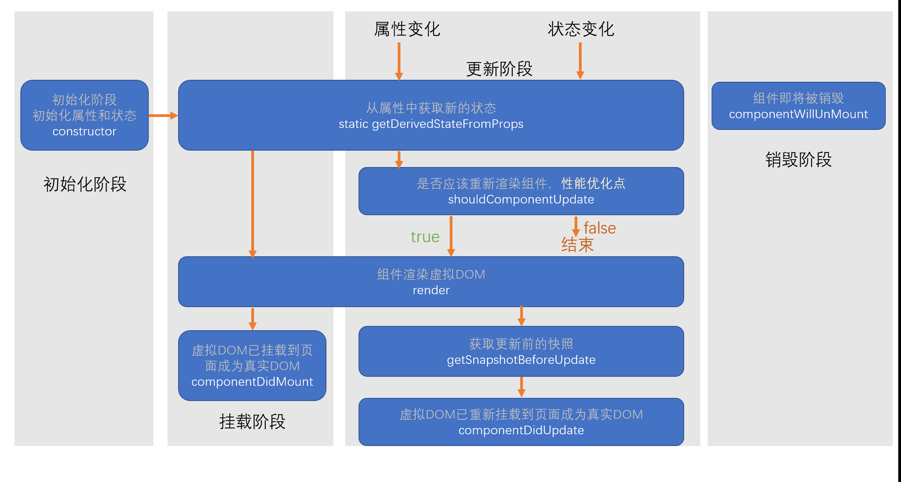
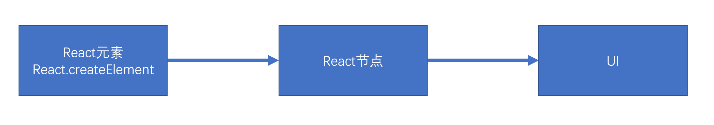
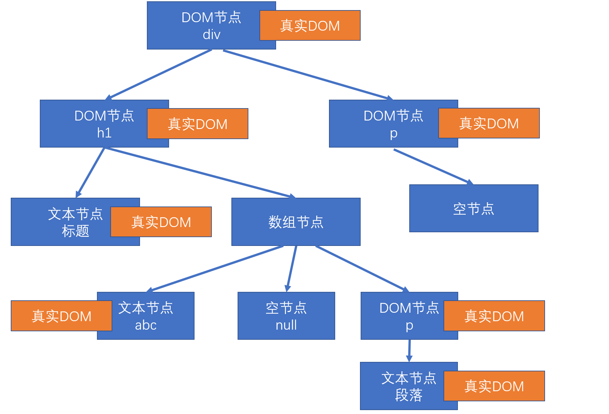
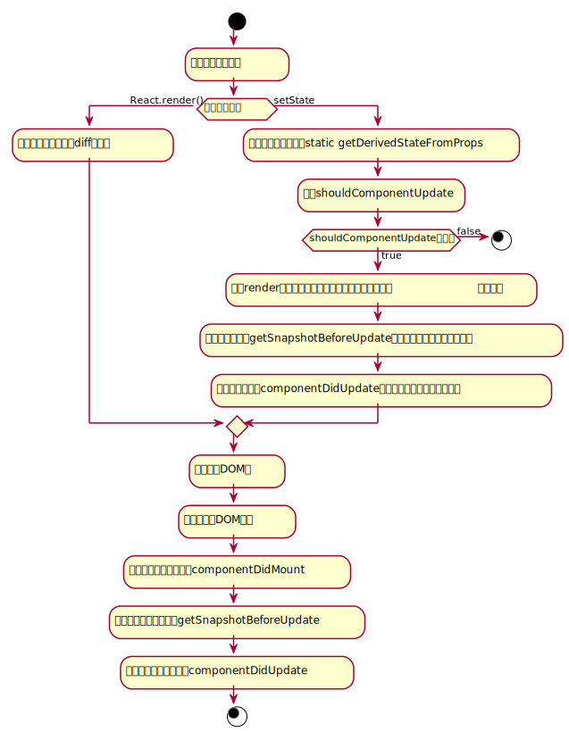
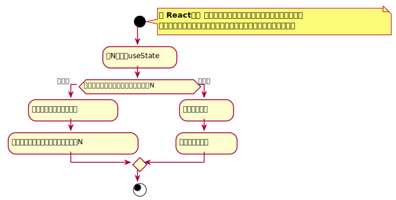
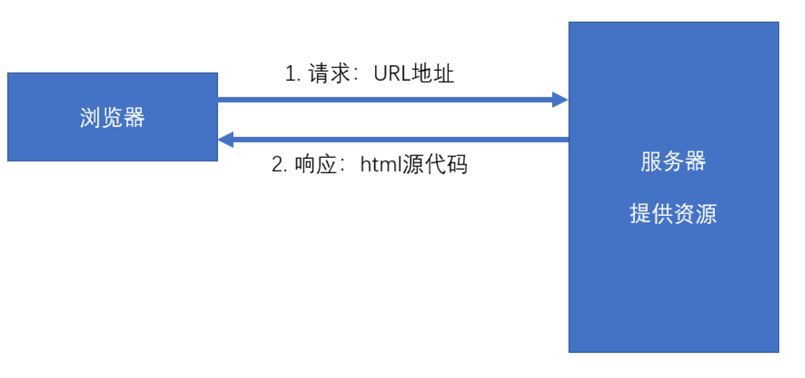
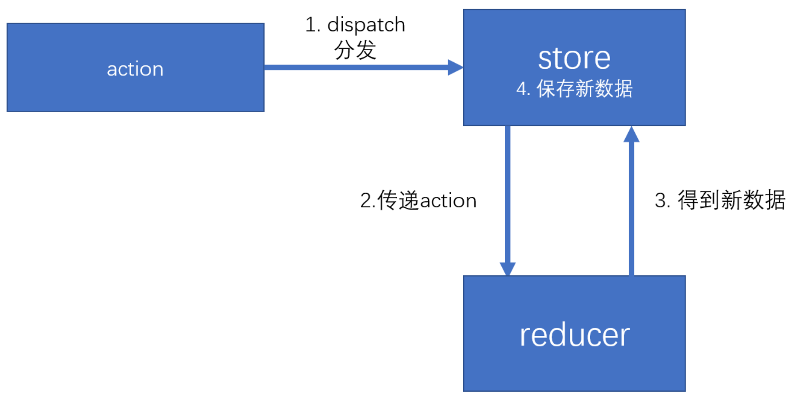
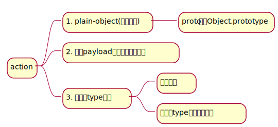
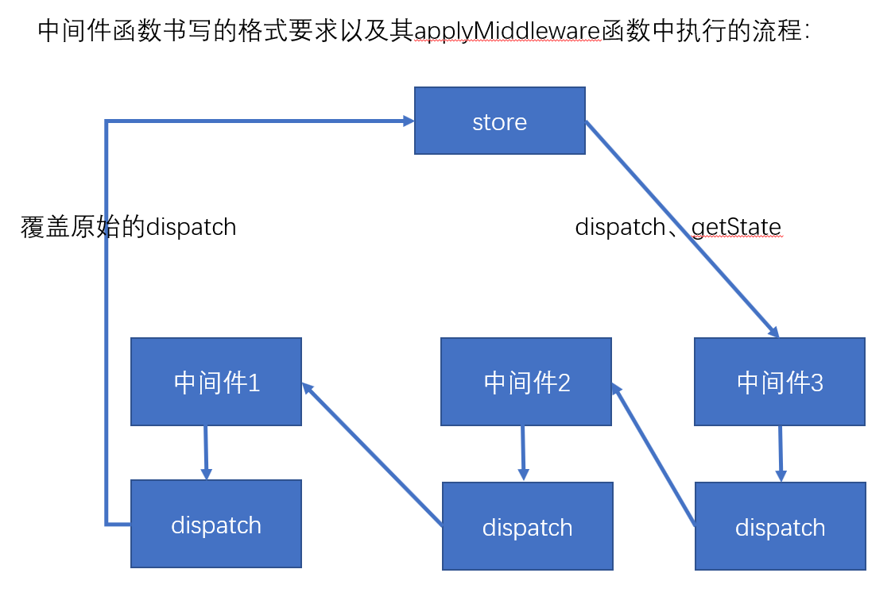

# React

[TOC]

## 概述

### React简介

[官网]( https://react.docschina.org/ )

1. 什么是React?

   React是有Facebook研发的，用于**解决UI复杂度**的开源Javascript库，目前由React联合社区维护。

   > 它不是框架，只是为了解决UI复杂度而诞生的一个库

2. React的特点

   - 轻量：React的开发版所有源码（包含注释）仅3000多行
   - 原生：所有的React的代码都是用原生JS书写而成，不依赖其他库
   - 易扩展：React对代码的封装程度较低，也没有过多的使用魔法，所有React中的很多功能可以扩展
   - 不依赖宿主环境：React只依赖原生的JS语言，不依赖任何其他东西，包括运行环境。因此，它可以被轻松的移植到浏览器、桌面应用、移动端
   - 渐进式：React并非框架，对整个工程没有强制约束力。这对与那些以存在的工程，可以逐步的将其改造为React，而不需要全盘重写
   - 单向数据流：所有的数据自顶而下的流动
   - 用JS代码声明界面
   - 组件化

3. 对比Vue

   | 对比项 |   Vue   |   React   |
   | :----: | :--: | :--: |
   |   全球使用量     |  | √ |
   |    国内使用量    | √ |      |
   |    性能    | √ | √ |
   |     易上手   | √ |      |
   |   灵活度     |      | √ |
   | 大型企业 | | √ |
   | 中/小型企业 | √ |  |
   | 生态 | | √ |

4. 学习路径

   整体原则：熟悉API --> 深入理解原理

   1. React
      1. 基础：掌握React的基本使用方法，有能力制作各种组件，并理解其基本的运作原理
      2. 进阶：掌握React中的一些黑科技，提高代码质量
   2. React-Router：相当于 vue-router
   3. Redux：相当于vuex
      1. Redux本身
      2. 各种中间件
   4. 第三方脚手架：umi
   5. UI库：Ant Design，相当于Vue的Element-UI 或 IView
   6. 源码分析
      1. React源码分析
      2. Redux源码分析

### Hello Wrold

```html
 <!-- ... 其它 HTML ... -->

  <div id="root"></div>
  <!-- 加载 React。-->
  <!-- 注意: 部署时，将 "development.js" 替换为 "production.min.js"。-->
  <!-- script标签中加入crossorigin属性的主要目的是为了更详细的显示错误信息 -->
  <!-- React的核心库，与宿主环境无关 -->
  <script src="https://unpkg.com/react@16/umd/react.development.js" crossorigin></script>
  <!-- 依赖核心库，将核心的功能与页面结合 -->
  <script src="https://unpkg.com/react-dom@16/umd/react-dom.development.js" crossorigin></script>
  <!-- 编译JSX -->
  <script src="https://unpkg.com/babel-standalone@6/babel.min.js"></script>
  <script>
      ReactDOM.render('Hello world', document.getElemetById('root'));
  </script>
```

1. `React.createElement`：React核心库中的方法

   创建一个**React**元素，称作虚拟DOM，本质上是一个对象

   1. 参数1：元素类型，如果是字符串，就是一个普通的html元素
   2. 参数2：元素的属性，一个对象
   3. 后续参数：元素的子节点

   ```javascript
   var h1 = React.createElement("h1", {
       title: "第一个React元素"
   }, "hello world");
   
   var span = React.createElement('span', {}, '这是一个span元素')
   ```

2. JSX

   JS的扩展语法，需要用babel进行转义

   ```html
   <script type="text/babel">
   	var span = <span>一个span元素</span>
   	var h1 = <h1 title="第一个React元素">Hello World  <span>一个span元素</span></h1>
   	ReactDOM.render(h1, document.getElemetById('root'));
   </script>
   ```

3. `ReactDOM.render`：React-dom库中的方法，负责将React元素渲染成真实的DOM元素

### 使用脚手架

1. 脚手架类型
   - 官方：create-react-app
   - 第三方：next.js、umi.js
2. 凡是使用JSX的文件，必须导入React
3. React项目支持`.js, .jsx`文件

```javascript
yarn create react-app project-name
```

### 开发环境搭建

1. vscode配置

   emmet配置：文件 --> 首选项 --> 设置 --> emmet

   ```json
   "javascript":"javascriptreact"
   ```

2. vscode插件安装

   - ESLint：代码风格检查
   -  ES7 React/Redux/GraphQL/React-Native snippets：快速代码编写

3. chrome插件安装

   - React Developer Tools

## 核心概念

### JSX语法

1. 什么是JSX语法？

   - FaceBook起草的JS扩展语法

   - 本质是一个JS对象，会被babel编译，最终会转换成createElement

   - 每个JSX表达式，**有且仅有一个根节点**，若想创建一个不影响页面结构的额根节点，使用`React.Fragment`

     ```javascript
     const h1 = (
     	<>
         	<h1>Hello World <span>span元素</span></h1>
         	<p>p元素</p>
         </>
     );
     // 等同于
     const h1 = (
     	<React.Fragment>
         	<h1>Hello World <span>span元素</span></h1>
         	<p>p元素</p>
         </React.Fragment>
     );
     ```

   - 每个JSX元素必须结束（XML规范）

2. 在JSX中嵌入表达式

   - 在JSX使用注释`{/* 注释 */}`
- 将表达式作为内容的一部分
  
  - `null、undefined、false`不显示
     - 普通对象，不可以作为子元素
     - 可以放置React元素对象
     - 表达式中的值为数组时，会将数组的每一项进行遍历并渲染，需要添加key属性
   - 将表达式作为元素属性
   - 属性使用**小驼峰命名法**
   - 防止注入攻击
     - 自动编码
     - dangerouslySetInnerHTML
  
3. 元素的不可变性

   - 虽然JSX元素是一个对象，但是该对象中的所有属性不可更改
   - 如果确实需要更改元素的属性，需要重新创建JSX元素

```javascript
     
	// 将表达式作为内容的一部分
	 const a = 111;
     const b = 2222;
     const obj1 = {
         a: 1,
         b: 2
     };
     const obj2 = (<span>span元素</span>);
                   
     const numbers = (new Array(30)).fill(0).map((item, i) => {
         return (<li key={i}>{i}</li>)
     })
                   
     
     const div = (
     	<div>
         	{ a } * { b } = { a*b }
         </div>
     	<p>
         	{ /* 普通对象无法放置 */ }
         	{ obj1 } // 出错
         </p>
     	<p>
         	{ obj2 } // 渲染
         </p>
		<ul>
         	{ numbers }    
         </ul>
     );
     
     // 等价于即内部会编译成
     React.createElement('div', {}, `${a} * ${b} = ${ a * b }`)

// 将表达式作为元素属性
const url = '....';
const cls = 'image';

cosnt div = (
	<div>
    	
    </div>
);

// 防止注入攻击
const content = '<h1>sdfdsfds</h1><p>dsfdsgfhgh</p>';
const div = (
	<div>
    	{/* content中的标签元素会被自动编码 */}
    	{content}
    </div>
);

const div = (
	<div dangerouslySetHTML={{
    	__html: content
    }}>
    </div>
);

// 元素的不可变性
let num = 1;
const div = (
	<div title="标题">{ num }</div>	
);

console.log(div.props.children); // 1

div.props.children = 2; // 报错
div.props.title = '测试'; // 报错

ReactDOM.render(div, document.getElementById('root'));

// 若是需要改变，则粗腰重新徐然
num = 2;
div = (
	<div title="标题">{ num }</div>	
);
ReactDOM.render(div, document.getElementById('root'));
```

### 组件和组件属性

**组件**：包含内容、样式和功能的UI单元

1. 创建组件

   **特别书注意：组件的名称首字母必须大写**

   1. 函数组件

      ```javascript
      function MyFuncComp() {
          return (<h1>组件内容</h1>)
      }
      
      // 使用组件
      ReactDOM.render((
      	<div>
          	{ /* 方式1：使用函数调用的方式使用，不推荐，因为呈现不出组件结构 */ }
          	{ MyFuncComp() }
               { /* 方式2，推荐使用 */ }
      		<MyFuncComp />
          </div>
      ) ,document.getElementById('root'));
      ```

   2. 类组件

      - 必须继承`React.Component`
      - 必须提供`render`函数，用于渲染组件

      ```javascript
      // MyClassComp.js
      import React from 'react';
      
      export default class MyClassComp extends React.Component {
          
          // 该方法必须返回React元素
          render() {
              return (<h1>类组件内容</H1>)
          }
      }
      
      // index.js
      import MyClassComp from './MyClassComp.js'
      
      ReactDOM.render((
      	<div>
          	<MyClassComp />
          </div>
      ), document.getElementById('root'));
      ```

2. 组件的属性

   **注意：组件的属性应该使用小驼峰命名法**

   - 对于**函数组件**，属性会作为一个对象的属性，传递给函数的参数
   - 对于**类组件**，属性会作为一个对象的属性，传递给构造函数的参数

   **组件无法改变自身的属性**

3. React中的哲学：数据属于谁，谁才有改动的权利（单向数据流）

   **React中的数据，是自顶向下流动**

### 组件状态

**组件状态**：组件可以自行维护的数据

1. 组件状态**仅在类组件中有效**

2. 状态(state)，本质上，是类组件的一个属性，是一个对象

3. 状态初始化

   - 在构造函数中初始化

     ```javascript
     constructor(props) {
         super(props);
         // 初始化状态
         this.state = {
             left: this.props.number
         };
         this.timer = setInterval(() => {
             // 会将状态进行混合
             this.setState({
                 left: this.state.left - 1
             });// 重新设置状态，触发自动重新渲染
             if (this.state.left === 0) {
                 clearInterval(this.timer);
             }
         }, 1000);
     }
     ```

   - 使用类属性进行初始化

     ```javascript
     export default class Tick extends React.Component {
         // 初始化状态，JS Next 语法，目前处于试验阶段
         // 该属性创建会在构造函数结束之后
         state={
             left: this.props.number
         }
     }
     ```

4. React中不能直接改变状态：因为React无法监控到状态发生了变化

   状态的变化，必须使用`this.setState({})`来改变

   一旦调用`this.setState`，组件就会重新渲染

   ***猜想***：`this.setState`方法，改变状态是同步进行的，重新渲染组件是异步进行的

5. 组件中的数据

   - props：该数据是由组件的使用者传递的数据，所有权不属于组件本身，因此组件无法改变该数据
   - state：该数据是由组件自身创建的，所有权属于组件自身，因此组件有权改变该数据

### 事件

在React中，组件的事件，本质上就是一个属性

按照之前Ract组件的约定，由于事件的本质是一个属性，因此也需要使用小驼峰命名法

**如果没有特殊处理，在事件处理函数中，this指向undefined**

- 使用bind函数，绑定this
- 使用箭头函数

```javascript
function handleClick(e) {
    console.log('click');
    console.log(e);
}

// 内置html组件的事件与原生dom一一对应，只是命名方式变为了小驼峰命名法
// 在React中事件的本质就是一个属性并赋值为函数，然后在合适的时候，调用该函数，实现回调
	// 只是在React内置组件中做了相应的回调处理，而自定义组件中需要自己定义回调的时机
cosnt btn = (
	<button onClick={this.handleClick}></button>
	<button onClick={ (e) => {  console.log(e); } }></button>
);


// 处理事件中的this问题

// 1. bind函数
constructor(props) {
    // 将原型上的事件处理函数绑定好this赋值到对象上
    super(props);
    this.handleClick = this.handleClick.bind(this);
    this.handleOver = this.handleOver.bind(this);
}

cosnt btn = (
    // 这种处理方式，效率较低，因为每次重新渲染都要生成一个新的函数
	<button onClick={this.handleClick.bind(this)}></button>
);

// 2、箭头函数
handleClick = () => {
    // 根据es6语法，handleClick会成为对象的一个属性，而箭头函数的指向为外层非箭头函数的this指向
    console.log(this);
}

```

### 深入认识setState

1. setState，它对状态的改变，**可能**是异步的
   
   - 如果改变状态的代码处于某个HTML元素的事件中，则其实异步的
   - 否则，是同步的，即执行完setState之后立即同步状态并执行render函数，然后再执行setState后面的代码
2. 如果遇到某个事件中，需要同步调用setState多次，需要使用函数的方式得到最新状态
3. 最佳实践
   1. 把所有的setState当做异步处理
   
   2. 永远不要信任setState调用之后的状态
   
   3. 如果要使用改变之后的状态，需要使用回调函数( setState的第二个参数 )
   
   4. 如果新的状态要根据之前的状态进行运算，使用函数的方式改变状态 ( setState的第一个参数 )
   
      **个人理解**：该种方式与第一个参数为对象形式的调用方式相比
   
      - 前者，每次函数状态改变函数均会对state进行改变，待所有状态改变完成后，触发render
      - 后者，将多次状态改变完成后，再统一对stete进行改变，然后触发render
4. React会对**异步的setState**进行优化：将多次setState进行合并（将多次状态改变完成后，再统一对stete进行改变，然后触发render）

```javascript
import React, { Component } from 'react'

export default class Comp extends Component {

    state = {
        n: 0
    }

	// 情景1
    handleClick = () => {
        this.setState({
            n: this.state.n + 1
        }, () => {
            //状态完成改变之后触发，该回调运行在render之后
            console.log(this.state.n);
        });
    }
    
    // 情景2
    handleClick = () => {
        this.setState(cur => {
            //参数cur表示当前的状态
            //该函数的返回结果，会混合（覆盖）掉之前的状态
            //该函数是异步执行
            return {
                n: cur.n + 1
            }
        }, ()=>{
            //所有状态全部更新完成，并且重新渲染后执行
            console.log("state更新完成", this.state.n);
        });

        this.setState(cur => ({
            n: cur.n + 1
        }));

        this.setState(cur => ({
            n: cur.n + 1
        }));
    }
    
    // 情景3
    // constructor(props) {
    //     super(props);
    //     setInterval(() => {
    	   // 此处，非事件处理函数中，setState同步执行
    //         this.setState({
    //             n: this.state.n + 1
    //         });

    //         this.setState({
    //             n: this.state.n + 1
    //         });
    //         this.setState({
    //             n: this.state.n + 1
    //         });
    //     }, 1000)
    // }

    render() {
        console.log("render");
        return (
            <div>
                <h1>
                    {this.state.n}
                </h1>
                <p>
                    <button onClick={this.handleClick}>+</button>
                </p>
            </div>
        )
    }
}
```

### 生命周期

**生命周期**：组件从诞生到销毁会经历一系列的过程，该过程就叫做生命周期。React在组件的生命周期中提供了一系列的钩子函数（类似于事件），可以让开发者在函数中注入代码，这些代码会在适当的时候运行

**生命周期仅存在于类组件中，函数组件每次调用都是重新运行函数，旧的组件即刻销毁**

#### 旧版生命周期

指的是：React版本 < 16.0.0


1. constructor
   - 同一个组件对象只会创建一次
   - 不能在第一次**挂载到页面之前**，调用setState，为了避免问题，构造函数中严禁使用setState
2. componentWillMount**（16版本以上已移除）**
   - 和构造函数一样，它只会运行一次
   - 可以使用setState，但是为了避免bug，不允许使用，因为在某些特殊情况下，该函数可能会调用多次
3. **render**
   - 返回一个虚拟DOM，会被挂载到虚拟DOM树中，最终渲染到页面的真实DOM中
   - render可能不止运行一次，只要需要重新渲染，就会运行
   - 严禁使用setState，因为可能会导致无限递归渲染
4. **componentDidMount**
   - 只会执行一次
   - 可以使用setState
   - 通常情况下，会将网络请求、启动计时器等一开始需要的操作，书写到该函数中
5. componentWillReceiveProps**（16版本以上已移除）**
   - 即将接收新的属性值，指属性被重新赋值
   - 参数为新的属性对象
   - 该函数可能会产生一些bug，**不推荐使用**
6. **shouldComponnetUpdate**
   - 指示React是否要重新渲染该组件，通过返回true和false来指定
   - 默认情况下，返回true
7. componentWillUpdate**（16版本以上已移除）**
   - 组件即将被重新渲染
8. componentDidUpdate
   - 往在该函数中使用dom操作，改变元素
9. **componentWillUnmount** 
   -  通常在该函数中销毁一些组件依赖的资源，比如计时器 

#### 新版生命周期

指的是：React版本 >= 16.0.0

React官方认为，某个数据的来源必须是单一的

React16废弃的三个生命周期函数

- componentWillMount
- componentWillReceiveProps
- componentWillUpdate



1. getDerivedStateFromProps
   - 通过参数可以获取新的属性和状态
   - 该函数是静态的
   - 该函数的返回值会覆盖掉组件状态
   - 该函数几乎没有什么作用
2. getSnapshotBeforeUpdate
   - 真实的DOM构建完成，但是还未实际渲染到页面中
   - 在该函数中，通常用于实现一些附加的DOM操作
   - 该函数的返回值，会作为componentDidUpdate的第三个参数

### 传递元素内容

1. 内置组件：div、p、h1等

   ```html
   <div>
       元素内容
   </div>
   ```

2. 自定义组件

   如果给自定义组件传递元素内容，则React会将元素内容作为children属性传递过去

   ```javascript
   // index.js
   import React from 'react';
   import ReactDOM from 'react-dom';
   import Comp from "./Comp"
   
   ReactDOM.render((
       <Comp content1={<h2>第2组元素内容</h2>} content2={<h2>第3组元素内容</h2>}>
   
           <h2>第1组元素内容</h2>
   
       </Comp>
   ), document.getElementById('root'));
   
   // Comp.js
   import React from 'react'
   
   export default function Comp(props) {
       console.log(props);
       return (
           <div className="comp">
               <h1>组件自身的内容</h1>
               {/* {props.children || <h1>默认值</h1>} */}
               {props.children}
               {props.content1}
               {props.content2}
           </div>
       )
   }
   ```

### 表单

   1. 受控组件和非受控组件
      - 受控组件：组件的使用者，有能力完全控制该组件的行为和内容。通常情况下，受控组件往往没有自身的状态，其内容完全受到属性的控制
      - 非受控组件：组件的使用者，没有能力控制该组件的行为和内容，组件的行为和内容完全自行控制
   2. **表单组件**，默认情况下是非受控组件，一旦设置了表单组件的value属性，则其变为受控组件(单选和多选框需要设置checked属性)

## React进阶

### 属性默认值和属性类型检查

1. 属性默认值

   通过一个**静态属性**`defaultProps`告知React属性默认值

   ```javascript
   // 函数组件
   import React from 'react'
   
   export default function FuncDefault(props) {
       console.log(props);//已经完成了混合
       return (
           <div>
               a:{props.a}，b:{props.b}，c:{props.c}
           </div>
       )
   }
   //属性默认值
   FuncDefault.defaultProps = {
       a: 1,
       b: 2,
       c: 3
   }
   
   // 类组件
   
   import React from 'react'
   
   export default class ClassDefault extends React.Component {
   
       static defaultProps = {
           a: 1,
           b: 2,
           c: 3
       }
   
       constructor(props) {
           super(props);
           console.log(props);
       }
   
       render() {
           return (
               <div>
                   a:{this.props.a}，b:{this.props.b}，c:{this.props.c}
               </div>
           )
       }
   }
   // //属性默认值
   // ClassDefault.defaultProps = {
   //     a: 1,
   //     b: 2,
   //     c: 3
   // }
   ```

2. 属性类型检查

   使用库`prop-types`

   对组件使用静态属性`propTypes`告知React如何检查属性

   ```javascript
   PropTypes.any：//任意类型
   PropTypes.array：//数组类型
   PropTypes.bool：//布尔类型
   PropTypes.func：//函数类型
   PropTypes.number：//数字类型
   PropTypes.object：//对象类型
   PropTypes.string：//字符串类型
   PropTypes.symbol：//符号类型
   
   PropTypes.node：//任何可以被渲染的内容，字符串、数字、React元素
   PropTypes.element：//react元素
   PropTypes.elementType：//react元素类型
   PropTypes.instanceOf(构造函数)：//必须是指定构造函数的实例
   PropTypes.oneOf([xxx, xxx])：//枚举
   PropTypes.oneOfType([xxx, xxx]);  //属性类型必须是数组中的其中一个
   PropTypes.arrayOf(PropTypes.XXX)：//必须是某一类型组成的数组
   PropTypes.objectOf(PropTypes.XXX)：//对象由某一类型的值组成
   PropTypes.shape(对象): //属性必须是对象，并且满足指定的对象要求
   PropTypes.exact({...})：//对象必须精确匹配传递的数据
   
   //自定义属性检查，如果有错误，返回错误对象即可
   属性: function(props, propName, componentName) {
      //...
   }
   ```

   ```javascript
   import React, { Component } from 'react'
   import PropTypes from "prop-types";
   
   export class A {
   
   }
   
   export class B extends A {
   
   }
   
   export default class ValidationComp extends Component {
       //先混合属性
       static defaultProps = {
           b: false
       }
   
       //再调用相应的函数进行验证
       static propTypes = {
           a: PropTypes.number.isRequired,  //a属性必须是一个数字类型,并且必填
           b: PropTypes.bool.isRequired, //b必须是一个bool属性,并且必填
           onClick: PropTypes.func, //onClick必须是一个函数
           c: PropTypes.any, //1. 可以设置必填   2. 阵型保持整齐（所有属性都在该对象中）
           d: PropTypes.node.isRequired, //d必填，而且必须是一个可以渲染的内容，字符串、数字、React元素
           e: PropTypes.element, //e必须是一个React元素
           F: PropTypes.elementType, //F必须是一个组件类型
           g: PropTypes.instanceOf(A), //g必须是A的实例
           sex: PropTypes.oneOf(["男", "女"]), //属性必须是数组当中的一个
           h: PropTypes.arrayOf(PropTypes.number), //数组的每一项必须满足类型要求
           i: PropTypes.objectOf(PropTypes.number), //每一个属性必须满足类型要求
           j: PropTypes.shape({ //属性必须满足该对象的要求
               name: PropTypes.string.isRequired, //name必须是一个字符串，必填
               age: PropTypes.number, //age必须是一个数字
               address: PropTypes.shape({
                   province: PropTypes.string,
                   city: PropTypes.string
               })
           }),
           k: PropTypes.arrayOf(PropTypes.shape({
               name: PropTypes.string.isRequired,
               age: PropTypes.number.isRequired
           })),
           m: PropTypes.oneOfType([PropTypes.string, PropTypes.number]),
           score: function (props, propName, componentName) {
               console.log(props, propName, componentName);
               const val = props[propName];
               //必填
               if (val === undefined || val === null) {
                   return new Error(`invalid prop ${propName} in ${componentName}，${propName} is Required`);
               }
               //该属性必须是一个数字
               if (typeof val !== "number") {
                   return new Error(`invalid prop ${propName} in ${componentName}，${propName} is not a number`);
               }
               const err = PropTypes.number.isRequired(props, propName, componentName);
               if(err){
                   return err;
               }
               //并且取值范围是0~100
               if (val < 0 || val > 100) {
                   return new Error(`invalid prop ${propName} in ${componentName}，${propName} must is between 0 and 100`);
               }
           }
       }
   
       render() {
           const F = this.props.F;
           return (
               <div>
                   {this.props.a}
                   <div>
                       {this.props.d}
                       <F />
                   </div>
               </div>
           )
       }
   }
   ```

### HOC

 **HOF**：Higher-Order Function, 高阶函数，以函数作为参数，并返回一个函数

**HOC**: Higher-Order Component, 高阶组件，以组件作为参数，并返回一个组件 

 通常，可以利用HOC实现**横切关注点** 

>  举例：
>
> 1. 20个组件，每个组件在创建组件和销毁组件时，需要作日志记录 
> 2. 20个组件，它们需要显示一些内容，得到的数据结构完全一致 

**注意**：

-  不要在render中使用高阶组件 
-  不要在高阶组件内部更改传入的组件 

**个人补充**

1. HOC组件的命名方式，一般为`with + 要分离的功能`，如`withLog、withLogin`等

2. 一般将传入的组件，不做任何改动的在render中显示

3. HOC组件中，导出的是一个函数组件，该组件运行后返回的组件可以是函数组件/类组件，如下

   ```react
   // withLog.js
   import React from "react";
   
   export default function withLog(Comp, str) {
     return class LoginWrapper extends React.Component {
       componentWillMount() {
         console.log(`日志：组件${Comp.name}被创建了！${Date.now()}`);
       }
       componentWillUnmount() {
         console.log(`日志：组件${Comp.name}被销毁了！${Date.now()}`);
       }
       render() {
         return (
           <>
             <h1>{str}</>
             <Comp {...this.props} />
           </>
         );
       }
     };
   }
   
   // withLogin.js
   import React from "react";
   import PropTypes from "prop-types";
   
   export default function withLogin(Comp, title) {
     LoginWrapper.propTypes = {
       isLogin: PropTypes.bool.isRequired
     };
   
     function LoginWrapper(props) {
       if (props.isLogin) {
         return (
           <>
             <h1>{title}</h1>
             <Comp {...props} />
           </>
         );
       }
       return null;
     }
     return LoginWrapper;
   }
   ```

### ref

reference引用

1. 使用场景：希望直接使用DOM元素中的某个方法，后者希望直接使用自定义组件中的某个方法

   -  ref作用于内置的html组件，得到的将是真实的dom对象
   - ref用于类组件，得到的将是类的实例
   - ref不能用于函数组件（ref写的位置，不能是函数组件，函数组件内部可以使用）：React认为获得函数组件的引用没有意义

2. ref不再推荐使用字符串赋值，字符串赋值的方式将来可能会被移除；

   目前，ref推荐使用功能对象或者函数

   **对象**

   - 通过`React.createRef`函数创建

   **函数**

   函数的调用时间

   1. `componentDidMount`时候会调用该函数

      在`componnetDidMount`事件中可以使用ref

   2. 如果ref的值发生了变动（旧函数被新函数替代），分别调用旧的函数和新的函数，时间点出现在`componentDidUpdate`之前

      - 旧的函数被调用时，传递null
      - 新的函数被调用时，传递对象

      ```react
        		<input type="text" ref={el => {
                  console.log('调用函数', el);
                  this.txt = el;
              }} />
              <button onClick={() => {
                  this.setState({});
              }}>测试</button>
      ```

   3. 如果ref所在的组件被卸载，会调用函数

3. **谨慎使用ref**

      能够使用属性和状态进行控制，就不要使用ref

      - 调用真实DOM对象中的方法
      - 某个时候需要调用类组件中的方法
            
      
```react
// 对象形式使用ref
import React, { Component } from "react";

class A extends Component {
  method() {
    console.log("调用了组件A的方法");
  }
  render() {
    return <h1>组件A</h1>;
  }
}

export default class Comp extends Component {
  constructor(props) {
    super(props);
    this.txt = React.createRef();
    this.compA = React.createRef();
  }

  handleClick = () => {
    console.log(this.compA.current);
    this.txt.current.focus();
    this.compA.current.method();
  };

  render() {
    return (
      <div>
        <input ref={this.txt} id="inp" type="text" />
        <A ref={this.compA} />
        <button onClick={this.handleClick}>获取焦点</button>
      </div>
    );
  }
}
// 函数形式使用ref
import React, { Component } from "react";

export default class Comp extends Component {
  state = {
    show: true
  };

  getRef = el => {
    console.log("函数被调用了", el);
    this.txt = el;
  };

  handleClick = () => {
      this.setState({
          show: !this.state.show
      });
  };

  componentDidMount() {
    console.log("didMount", this.txt);
  }

  render() {
    return (
      <div>
        {
            this.state.show && <input ref={this.getRef} type="text" />
        }
        <button onClick={this.handleClick}>获取焦点</button>
      </div>
    );
  }
}

```

### ref转发

1. 使用`fowardRef`方法
   1. 参数，传递的是**函数组件**，不能是类组件，并且，函数组件需要有第二个参数来得到ref
   2. 返回值，返回一个新的组件
2. ref转发的使用场景：当需要引用函数组件的内部元素，而非组件本身时

```react
import React, { Component } from "react";

function A(props, ref) {
  return (
    <>
      <h1 ref={ref}>A</h1>
      <p>{props.words}</p>
    </>
  );
}

const NewA = React.forwardRef(A);

export default class Comp extends Component {
  ARef = React.createRef();

  componentDidMount() {
    console.log("componentDidMount", this.ARef);
  }

  render() {
    return (
      <div>
        {/* <A ref={this.ARef} /> */}
        <NewA ref={this.ARef} words="sfdsdfsadf" />
      </div>
    );
  }
}
```

```react
// 转发类组件（将类组件用函数组件进行包装后进行转发）
import React, { Component } from "react";

class A extends Component {
  render() {
    return (
      <h1 ref={this.props.forwardRef}>
        组件A
        <span>{this.props.words}</span>
      </h1>
    );
  }
}

const NewA = React.forwardRef((props, ref) => {
  return <A {...props} forwardRef={ref} />
});

export default class Comp extends Component {
  ARef = React.createRef();

  componentDidMount() {
    console.log("componentDidMount", this.ARef);
  }

  render() {
    return (
      <div>
        {/* <A ref={this.ARef} /> */}
        <NewA ref={this.ARef} words="sfdsdfsadf" />
      </div>
    );
  }
}
```

### context

上下文：context，表示做某一些事情的环境

1. React中的上下文特点

   - 当某个组件创建了上下文后，上下文中的数据，会被所有的后代组件共享
   - 如果某个组件依赖了上下文，会导致该组件不在纯粹（纯粹指的是：外部数据仅来源于属性props）
   - 一般情况下，用于第三方组件（通用组件）

2. 旧版本API

   **创建上下文**

   只有类组件才可以创建上下文

   1. 给类组件书写静态属性`childContextTypes`，使用该属性对上下文中的数据类型进行约束
   2. 添加实例方法`getChildContext`，该方法返回的对象，即为上下文数据，该数据必须满足类型约束，该方法会在每次render之后运行

   **使用上下文中的数据**

   要求：如果要使用上下文中的数据，组件必须有一个静态属性`contextTypes`，该属性描述了需要获取的上下文中的数据类型

   1. 可以在组件的构造函数中，通过第二个参数，获取上下文数据
   2. **从组件的`context`属性中获取**
   3. 在函数组件中，通过第二个参数，获取上下文数据

   **上下文数据变化**

   1. 上下文中的数据不可以直接变化，最终都是通过状态改变
   2. 在上下文中加入一个处理函数，可以用于后代组件更改上下文数据

   ```react
   import React, { Component } from "react";
   import PropTypes from "prop-types";
   
   const types = {
     a: PropTypes.number,
     b: PropTypes.string.isRequired,
     onChangeA: PropTypes.func
   };
   
   function ChildA(props, context) {
     return (
       <div>
         <h1>ChildA</h1>
         <h2>
           a:{context.a}，b:{context.b}
         </h2>
         <ChildB />
       </div>
     );
   }
   
   ChildA.contextTypes = types;
   
   class ChildB extends Component {
     static contextTypes = types;
   
     constructor(props,context) {
         super(props, context);
     }
   
     render() {
       return (
         <p>
           ChildB，来自于上下文的数据：a: {this.context.a}, b:{this.context.b}
           <button
             onClick={() => {
               this.context.onChangeA(this.context.a + 2);
             }}
           >
             子组件的按钮，a+2
           </button>
         </p>
       );
     }
   }
   
   export default class Comp extends Component {
     static childContextTypes = types;
   
     state = {
       a: 123,
       b: "abc"
     };
   
     getChildContext() {
       return {
         a: this.state.a,
         b: this.state.b,
         onChangeA: newA => {
           this.setState({
             a: newA
           });
         }
       };
     }
   
     render() {
       return (
         <div>
           <ChildA />
         </div>
       );
     }
   }
   ```

3. 新版本API

   旧版本API存在严重的效率问题，并且容易导致滥用
   
   **创建上下文**
   
   上下文是一个独立于组件的对象，该对象通过`React.createContext(默认值)`创建，返回的是一个包含两个属性的对象
   
   1. Provider属性：生产者。一个组件，该组件会创建一个上下文，该组件有一个value属性，通过该属性，可以为其数据赋值
   
      同一个Provider，不要用到多个组件中，如果需要在其他组件中使用该数据，应该考虑将数据提升到更高的层次
   
   2. Consumer属性
   
   **使用上下文中的数据**
   
   1. 类组件中获取上下文
   
      1. 在类组件中，直接使用`this.context`获取上下文数据
   
         要求：必须拥有静态属性`contextTypes`，应赋值为创建的上下文对象
   
      2. 在类组件中，也可以使用`consumer`来获取上下文数据
   
   2. 在函数组件中，需要使用`consumer`来获取上下文数据
   
      - Consumer是一个组件
      - 它的子节点，是一个函数（它的props.children需要传递一个函数）
   
   **注意细节**
   
   如果，上下文提供者（Context.Provoder）中的value属性发生变化（Object.i比较），会导致该上下文提供的所有后代元素全部重新渲染，无论该子元素是否优化（无论`shouldComponentUpdate`函数返回什么结果）
   
4. 上下文的应用场景：编写一套组件（有多个组件），这些组件之间需要相互配合才能最终完成功能

   ```react
   import React, { Component } from "react";
   
   const ctx = React.createContext();
   
   function ChildA(props) {
     return (
       <div>
         <h1>ChildA</h1>
         <h2>
           <ctx.Consumer>
             {value => (
               <>
                 {value.a}, {value.b}
               </>
             )}
           </ctx.Consumer>
         </h2>
         <ChildB />
       </div>
     );
   }
   
   class ChildB extends Component {
     render() {
       return (
         <ctx.Consumer>
           {value => (
             <p>
               ChildB，来自于上下文的数据：a: {value.a}, b:{value.b}
               <button
                 onClick={() => {
                   value.changeA(value.a + 2);
                 }}
               >
                 后代组件的按钮，点击a+2
               </button>
             </p>
           )}
         </ctx.Consumer>
       );
     }
   }
   
   // class ChildB extends Component {
   //   static contextType = ctx;
   
   //   render() {
   //     return (
   //       <>
   //         a: {this.context.a},
   //         b: {this.context.b}
   //         <button onClick={() => {
   //             this.context.changeA(this.context.a + 1);
   //         }}>加1</button>
   //       </>
   //     );
   //   }
   // }
   
   export default class NewContext extends Component {
     state = {
       a: 0,
       b: "abc",
       changeA: newA => {
         this.setState({
           a: newA
         });
       }
     };
   
     render() {
       return (
         <ctx.Provider value={this.state}>
           <div>
             <ChildA />
           </div>
         </ctx.Provider>
       );
     }
   }
   ```
   
### `PureComponent`, 纯组件

纯组件：用于避免不必要的渲染（运行render函数），从而提高效率

优化：如果一个组件的属性和状态，都没有发生变化，重新渲染该组件是没有必要的

`PureComponent`是一个组件，如果某个组件继承自该组件，则该组件的`shouldComponentUpdate`会进行优化，即对属性和状态进行浅比较

**注意**

1. `PureComponent`进行浅比较

   - 为了效率，应该尽量使用`PureComponent`
   - 要求不要改动之前的状态，永远是创建新的状态覆盖之前的状态（Immutable，不可变对象）
   - 有一个第三方库，Immutable.js，它专门用于制作不可变对象

2. 函数组件，使用`React.memo`函数制作纯组件，其原理是使用HOC原理，返回一个类组件，类组件包含该函数组件

   ```react
   function memo(FuncComp) {
       return class Memo extends PureComponent {
           render() {
               return (
               	<>
                   	<FuncComp {...this.props} />
                   </>
               );
       }
   }
   ```

### render props

有时候，某些组件的各种功能及其处理的逻辑几乎完全相同，只是显示的界面不一样，建议下面的方式任选其一来解决重复代码问题（横切关注点）

1. render props
   1. 某个组件，需要某个属性
   2. 该属性是一个函数，函数的返回值用于渲染
   3. 函数的参数会传递为需要的数据
   4. 注意纯组件的属性（尽量避免每次传递的render props的地址不一致）
   5. 通常该属性的名字叫做render
2. HOC

### Protals, 插槽

插槽：将一个**React元素**渲染到指定的DOM容器中

`ReactDOM.createProtal(React元素, 真实的DOM)`

**注意**

1. React中的事件是包装过的
2. 它的事件冒泡，是根据虚拟DOM树来冒泡的，与真实的DOM无关

```react
import React from 'react'
import ReactDOM from "react-dom"

function ChildA() {
    return ReactDOM.createPortal(<div className="child-a" style={{
        marginTop: 200
    }}>
        <h1>ChildA</h1>
        <ChildB />
    </div>, document.querySelector(".modal"));
}

function ChildB() {
    return <div className="child-b">
        <h1>ChildB</h1>
    </div>
}

export default function App() {
    return (
        <div className="app" onClick={e => {
            console.log("App被点击了", e.target)
        }}>
            <h1>App</h1>
            <ChildA />
        </div>
    )
}
```

### 错误边界

1. 默认情况下，若一个组件在**渲染期间**（render）发生错误，会导致整个组件树全部被卸载

2. 默认情况下的错误处理机制，组件发生错误之后，若无法处理错误，则按照层级，往父元素抛出错误，若父元素无法处理，则继续向上抛出，直到根组件，若根组件英文无法处理错误，则整个组件树全部被卸载

3. 错误边界：是一个组件，该组件会捕获到渲染期间（render）子组件发生的错误，并有能力阻止错误继续传播

4. **让某个组件捕获错误的方式**

   1. 编写生命周期函数` getDerivedStateFromError `
      - 静态函数
      - 运行时间点：渲染子组件的过程中，发生错误之后，更新页面之前
      - **注意**：只有子组件发生错误，才会运行该函数
      - 该函数返回一个对象，React会将该对象的属性覆盖掉当前组件的state
      - 函数存在一个参数：错误对象
      - 通常，该函数用于改变状态
   2. 编写生命周期函数`componentDidCatch`
      - 实例方法
      - 运行时间点：渲染子组件的过程中，发生错误，更新页面之后，由于其运行时间点比较靠后，因此不太会在该函数中改变状态（在其中改变状态比较浪费效率）
      - 该函数有两个参数：错误对象和错误信息
      - 通常，该函数用于记录错误消息（即发送到后台进行记录或者在控制台打印）

5. **细节**

   某些错误，错误边界组件无法捕获

   1. 自身的错误
   2. 异步的错误
   3. 事件中的错误

   总结：**仅处理渲染子组件期间的同步错误**

### React中的事件

   **这里的事件指的是：React内置的DOM组件中的事件**

1. 给`document`注册事件
2. 几乎所有的元素的事件处理，均在document的事件中处理
   1. 一些不冒泡的事件，是直接在元素上监听的
   2. 一些`docuemnt`上面没有的事件，直接在元素上监听
3. 在`document`的事件处理，React会**根据虚拟DOM树**完成事件函数的调用
4. React的事件参数，并非真实的DOM事件参数，是React合成的一个对象，该对象类似于真实DOM的事件参数
   1. `stopPropagation`，阻止事件在虚拟DOM中冒泡
   2. `nativeEvent`，可以得到真实的DOM事件对象
   3. 为了提高执行效率，React使用事件对象池来处理事件对象

**注意**

1. 如果给真实的DOM注册事件，阻止了事件冒泡，则会导致React的相应事件无法触发
2. 如果给真实的DOM注册事件，事件会先于React事件运行
3. 通过React的事件中阻止事件冒泡，无法阻止真实的DOM事件冒泡
4. 可以通过`nativeEvent.stopImmediatePropagation()`，阻止`document`上剩余事件的执行
5. 在事件处理程序中，不要异步的使用事件对象，如果一定要用，需要调用`persist`函数

### 渲染原理

渲染：生成用于显示的虚拟DOM对象，以及将这些对象形成真实的DOM对象

- `React元素`：`ReactElement`，通过 `React.createElement`创建（语法糖：JSX）

- `React节点`：专门用于渲染到UI界面的对象，React会通过React元素，创建React节点，ReactDOM**一定**是通过React节点来进行渲染的

  **节点类型**

  - React DOM节点：创建该节点的React元素，其类型是一个字符串
  - React 组件节点：创建该节点的React元素，其类型是一个函数或是一个类
  - React 文本节点：由字符串、数字创建的
  - React 空节点：由null、undefined、false、true
  - React 数组节点：该节点由一个数组创建

-  真实DOM：通过`document.createElement`创建的dom元素 



#### 首次渲染(新节点渲染)


1.  通过参数的值创建节点 
2.  根据不同的节点，做不同的事情
    1. 文本节点：通过`document.createTextNode`创建真实的文本节点
    2. 空节点：什么都不做
    3. 数组节点：遍历数组，将数组每一项递归创建节点（回到第1步进行反复操作，直到遍历结束）
    4. DOM节点：通过`document.createElement`创建真实的DOM对象，然后立即设置该真实DOM元素的各种属性，然后遍历对应React元素的children属性，递归操作（回到第1步进行反复操作，直到遍历结束）
    5. 组件节点
       1. 函数组件：调用函数(该函数必须返回一个可以生成节点的内容)，将该函数的返回结果递归生成节点（回到第1步进行反复操作，直到遍历结束）
       2. 类组件：
          1. 建该类的实例
          2. 立即调用对象的生命周期方法：`static getDerivedStateFromProps`
          3. 运行该对象的`render`方法，拿到节点对象（将该节点递归操作，回到第1步进行反复操作）
          4. 将该组件的`componentDidMount`加入到执行队列（先进先出，先进先执行），当整个虚拟DOM树全部构建完毕，并且将真实的DOM对象加入到容器中后，执行该队列
3.  生成出虚拟DOM树之后，将该树保存起来，以便后续使用
4.  将之前生成的真实的DOM对象，加入到容器中。

```react
const app = <div className="assaf">
    <h1>
        标题
        {["abc", null, <p>段落</p>]}
    </h1>
    <p>
        {undefined}
    </p>
</div>;
ReactDOM.render(app, document.getElementById('root'));
```

以上代码生成的虚拟DOM树： 



```react
function Comp1(props) {
    return <h1>Comp1 {props.n}</h1>
}

function App(props) {
    return (
        <div>
            <Comp1 n={5} />
        </div>
    )
}

const app = <App />;
ReactDOM.render(app, document.getElementById('root'));
```

以上代码生成的虚拟DOM树： 


```react
class Comp1 extends React.Component {
    render() {
        return (
            <h1>Comp1</h1>
        )
    }
}

class App extends React.Component {
    render() {
        return (
            <div>
                <Comp1 />
            </div>
        )
    }
}

const app = <App />;
ReactDOM.render(app, document.getElementById('root'));
```

以上代码生成的虚拟DOM树：


#### 更新节点



1. 节点更新的场景
   - 重新调用`ReactDOM.render`，触发根节点更新
   - 在类组件的实例对象中调用`setState`，会导致该实例所在的节点更新
   
2. 节点的更新

   - 如果调用的的是`ReactDOM.render`，进行根节点的对比（diff）更新

   - 如果调用的是`setState`
     1. 运行生命周期函数，`static getDerivedStateFromProps `
     2. 运行`shouldComponentUpdate`，如果该函数返回false，终止当前流程 
     3. 运行`render`，得到一个新的节点，进入该新的节点的**对比更新** 
     4. 将生命周期函数`getSnapshotBeforeUpdate`加入执行队列，以待将来执行 
     5. 将生命周期函数`componentDidUpdate`加入执行队列，以待将来执行 

   **后续步骤**

   1. 更新虚拟DOM树
   2. 完成真实的DOM更新
   3. 依次调用执行队列中的`componentDidMount`
   4. 依次调用执行队列中的`getSnapshotBeforeUpdate`
   5. 依次调用执行队列中的`componentDidUpdate`

3. 对比更新

   

   1. 将新产生的节点，对比之前虚拟DOM中的节点，发现差异，完成更新

   2. **问题：对比之前DOM树中的哪个节点？（即找对比目标）**

      React为了提高对比效率，做出以下假设：
   
      1. 假设节点不会出现层次的移动（对比时，直接找到旧树中对应位置的节点进行对比）
      2. 不同的节点类型会生成不同的结构
         1. 相同的节点类型：节点本身类型相同，如果是由React元素生成，type值还必须一致 
         2. 其他的，都属于不相同的节点类型
      3. 多个兄弟通过唯一标识（key）来确定对比的新节点
         - **key值的作用 **： 用于通过旧节点，寻找对应的新节点，如果某个旧节点有key值，则其更新时，会**寻找相同层级中**的相同key值的节点，进行对比
         - **key值应该在一个范围内唯一（兄弟节点中），并且应该保持稳定** 
      
   2. **找到对比目标**
   
      1. 判断节点类型是否一致
   
         1. 一致
   
            1. 根据不同的节点类型，做不通的事
               - 空节点：不做任何事情
               - DOM节点
                 1.  直接重用之前的真实DOM对象 
                 2.  将其属性的变化记录下来，以待将来统一完成更新（现在不会真正的变化） 
                 3.  遍历该新的React元素的子元素，**递归对比更新** 
               - 文本节点
                 1.  直接重用之前的真实DOM对象 
                 2.  将新的文本变化记录下来，将来统一完成更新 
               - 函数组件
                 1.  重新调用函数，得到一个节点对象，进入**递归对比更新** 
               - 类组件
                 1.  重用之前的实例 
                 2.  调用生命周期方法`static getDerivedStateFromProps`
                 3.  调用生命周期方法`shouldComponentUpdate`，若该方法返回false，终止 
                 4.  运行`render`，得到新的节点对象，进入**递归对比更新** 
                 5.  将该对象的`getSnapshotBeforeUpdate`加入队列 
                 6.  将该对象的`componentDidUpdate`加入队列 
               - 数组节点
                 1.  遍历数组进行**递归对比更新** 
   
         2. 不一致
   
             整体上，卸载旧的节点，全新创建新的节点 
   
            1. 创建新节点： 进入新节点的挂载流程 
            2. 卸载旧节点
               -  **文本节点、DOM节点、数组节点、空节点、函数组件节点**：直接放弃该节点，如果节点有子节点，递归卸载节点 
               -  **类组件节点**： 
                 1. 直接放弃该节点 
                 2. 调用该节点的`componentWillUnMount`函数 
                 3. 递归卸载子节点 
   
   3. **没找到对比目标**
   
      - **流程**
        1. 创建新加入的节点
        2. 卸载多余的旧节点
   
      - 通常情况下，在以下两种情况下，找不到度对比目标：
        1.  新的DOM树中有节点被删除 
        2.  新的DOM树中有节点添加 
   

#### 注意事项

在了解React相关的渲染原理后，在书写代码时，有一点注意的是，当控制一个元素的显示与隐藏的时，尽量不要改变元素的结构，这样会造成性能的损耗

```react
import React, { Component } from 'react'


export default class App extends Component {
    state = {
        visible: false
    }
    render() {
        // 不推荐做法
        // if (this.state.visible) {
        //     return <div>
        //         <h1>标题</h1>
        //         <button onClick={() => {
        //             this.setState({
        //                 visible: !this.state.visible
        //             })
        //         }}>显示/隐藏</button>
        //     </div>;
        // }
        //     return <div>
        //         <button onClick={() => {
        //             this.setState({
        //                 visible: !this.state.visible
        //             })
        //         }}>显示/隐藏</button>
        //     </div>;
        // }
        // 
        
        // 推荐做法1
        // 利用css控制元素的显示和隐藏
         return (
            <div>
               <h1 style={{display: this.state.visible ? 'block' : 'none'}}>标题</h1>
                <button onClick={() => {
                    this.setState({
                        visible: !this.state.visible
                    })
                }}>显示/隐藏</button>
            </div>
        )
        
        // 推荐做法2：无论显示隐藏，在该位置上都存在一个React元素，以提高对比更新时查找对比元素的效率
        const h1 = this.state.visible? <h1>标题</h1> : null;
        return (
            <div>
                {h1}
                <button onClick={() => {
                    this.setState({
                        visible: !this.state.visible
                    })
                }}>显示/隐藏</button>
            </div>
        )
    }
}
```

### 工具

**严格模式**

StrictMode(`React.StrictMode`)，本质是一个组件，该组件不进行UI渲染（如`React.Fragment <> `），它的作用是，在渲染内部组件时，发现不合适的代码

- 识别不安全的生命周期

- 关于使用过时字符串 ref API 的警告

- 关于使用废弃的 findDOMNode 方法的警告

- 检测意外的副作用 

  React要求，副作用代码仅出现在以下生命周期函数中 

  - ` ComponentDidMount `

  - ` ComponentDidUpdate `
  - ` ComponentWillUnMount `

  副作用： 一个函数中，做了一些会影响函数外部数据的事情，例如： 

  -  异步处理 
  -  改变参数值 
  -  setState 
  -  本地存储 
  -  改变函数外部的变量 

  **相反的，如果一个函数没有副作用，则可以认为该函数是一个纯函数**

  在严格模式下，虽然不能监控到具体的副作用代码，但它会将不能具有副作用的函数调用两遍，以便发现问题。（这种情况，仅在开发模式下有效） 

-  检测过时的 context API 

**Profiler**

性能分析工具，分析某一次或多次提交（更新），涉及到的组件的渲染时间

- 火焰图：得到某一次提交，每个组件总的渲染时间以及自身的渲染时间

- 排序图：得到某一次提交，每个组件自身渲染时间的排序

- 组件图：某一个组件，在多次提交中，自身渲染花费的时间

## HOOK

### HOOK简介

1. HOOK是React16.8.0之后出现 

2. 在React中，组件妇分为：无状态组件（函数组件）、类组件

3. 类组件中中存在的一些麻烦
   - this指向问题
   -  繁琐的生命周期 
   -  其他问题 

4. HOOK专门**用于增强函数组件的功能**（HOOK在类组件中是不能使用的），使之理论上可以成为类组件的替代品

5. 官方强调：没有必要更改已经完成的类组件，官方目前没有计划取消类组件，只是鼓励使用函数组件

6. HOOK（钩子）本质上是一个函数(命名上总是以use开头)，该函数可以挂载任何功能

7. HOOK种类：
   - `useState`
   - `useEffect`
   - 其他...

### State Hook

state Hool是一个在函数组件中使用的函数（`useState`），用于在函数组件中使用状态

1. `useState`函数
   - 函数有一个参数，这个参数的值表示状态的默认值
   - 函数的返回值是一个数组，该数组一定包含来两项

     1. 当前的状态值
     2. 改变状态的函数

2. 一个函数组件中可以有多个状态，这种做法非常有利于横向切分关注点

3. `useState`实现原理

   

4. **注意细节**

   - `useState`最好写到函数的起始位置，便于阅读 
   - `useState`严禁出现在代码块（判断、循环）中 
   - `useState`返回的函数（数组的第二项），**引用不变（节约内存空间）**
   - **使用函数改变数据**
   
       - 若数据和之前的数据完全相等（使用Object.is比较），不会导致重新渲染，以达到优化效率的目的 
       - **传入的值不会和原来的数据进行合并，而是直接替换**
   - 如果要实现强制刷新组件 
   
       - 类组件：使用`forceUpdate`函数 
         - 强制刷新，不会运行`shouldComponentUpdate`函数 
       - 函数组件：使用一个空对象的`useState `
   - **如果某些状态之间没有必然的联系，应该分化为不同的状态，而不要合并成一个对象**
   - 和类组件的状态一样，**函数组件中改变状态可能是异步的（在DOM事件中），多个状态变化会合并以提高效率**，此时，不能信任之前的状态，而应该使用回调函数的方式改变状态
       - **如果状态变化要使用到之前的状态，尽量传递函数**
### Effect Hook

Effect Hool：用于在函数组件中处理副作用

1. `useEffect`函数

   - 该函数接收一个函数作为参数，接收的函数就是需要进行副作用操作的函数
   - 副作用函数的运行时间点，是在**页面完成真实的UI渲染**之后，因此它的执行是异步的，并且不会阻塞浏览器 

2. **注意细节**

   - 副作用函数的运行时间点，是在**页面完成真实的UI渲染**之后，因此它的执行是异步的，并且不会阻塞浏览器 

     与类组件中`componentDidMount`和`componentDidUpdate`的区别

     - `componentDidMount`和`componentDidUpdate`，更改了真实DOM，但是用户还没有看到UI更新，同步的
     - `useEffect`中的副作用函数，更改了真实DOM，并且用户已经看到了UI更新，异步的

   -  每个函数组件中，可以多次使用`useEffect`，但**不要放入判断或循环等代码块中**

   - `useEffect`中的副作用函数，可以有返回值，**返回值必须是一个函数**，该函数叫做清理函数 

     - 该函数运行时间点，在每次运行副作用函数之前
     - 首次渲染组件不会运行
     - 组件被销毁时一定会运行

   - `useEffect`函数，可以传递第二个参数 

     - 第二个参数是一个数组
     - 数组中记录该副作用的依赖数据
     - 当组件重新渲染后，只有依赖数据与上一次不一样的时，才会执行副作用
     - 所以，当传递了依赖数据之后，如果数据没有发生变化
       - 副作用函数仅在第一次渲染后运行
       - 清理函数仅在卸载组件后运行
       - 使用空数组作为依赖项，则副作用函数仅在挂载时运行一次

   -  副作用函数中，如果使用了函数上下文中的变量，则由于闭包的影响，会导致副作用函数中变量不会实时变化。 

   -  副作用函数在每次注册时，会覆盖掉之前的副作用函数，因此，尽量保持副作用函数稳定，否则控制起来会比较复杂。 

### 自定义Hook

1. 自定义Hook：将一些常用的额、跨越多个组件的Hook功能，抽离出去形成一个函数，该函数就是自定义Hook

2. 自定义Hook，由于其内部需要使用Hook功能，所以它本身也需要按照Hook的规定实现

   1. 函数名必须以use开头
   2. 调用自定义Hook函数时，应该放到顶层

   例如：

   1. 很多组件需要在第一次加载完成之后，获取所有学生数据
   2. 很多组件都需要在第一次加载完成后，启动一个计时器，然后在组件销毁时卸载

   >  使用Hook的时候，如果没有严格按照Hook的规则进行，eslint的一个插件（eslint-plugin-react-hooks）会报出警告 

### Reducer Hook

学完Redux之后学习

### Context Hook

用于获取上下文数据

````react
import React, {useContext} from 'react';

const ctx = React.createContext();

function Test() {
    const value = useContext(ctx);
    return <h1>Test，上下文的值: { value }</h1>
}

export default function App() {
    return (
    	<div>
        	<ctx.Provider value="abc">
                <Test/>
            </ctx.Provider>
        </div>
    );
}
````

### Callback Hook

1. 函数名：`useCallback`，用于得到一个固定引用值的函数，**通常用它进行性能优化**

2. `useCallback`

   该函数有两个参数

   1. 函数，`useCallback`会固定该函数的引用，只要依赖项没有发生变化，则始终返回之前函数的地址
   2. 数组，记录依赖项

   该函数返回：引用相对固定的函数地址

### Memo Hook

1. 函数名：`useMemo`，用于保持一些比较稳定的数据，通常用于**性能优化**
2. **如果React元素本身的引用没有发生变化，一定不会重新渲染**

### Ref Hook

1. `useRef`:

   一个参数

   - 默认值

   返回一个固定对象：`{current: 值}`
   
2. **[个人理解]**：函数组件首次运行会运行该函数，产生一个对象，并由React节点持有该对象的引用，之后重新渲染均不会再运行该函数（即由`useRef`产生的对象，在函数组件销毁之前，一直保持原引用）

### ImpreativeHandle Hook

1. 对于类组件，可以使用ref得到其组件实例，然后通过实例使用其上面的一些方法，但是函数组件不可以

2. `useImperativeHandle`

   三个参数

   1. ref值，传入的ref对象`{current:值}`
   2. 函数，使用函数的返回值作为current属性的值
   3. 依赖项

   运行

   - 如果不给依赖项，则每次运行函数组件都会调用该方法
   - 如果使用了依赖项，则第一次调用后，会进行缓存，只有依赖项发生变化才会重新调用

```react
function Test(props, ref) {
    useImperativeHandle(ref, () => {
        // 相当于 ref.current = 1
        return 1;
    }, []);
}
```

### LayoutEffect Hook


1. `useEffect`：浏览器渲染完成之后，用户看到新的渲染效果之后
2. `useLayoutEffect`：浏览器完成了DOM改动，但没有呈现给用户
3. 应该尽量使用`useEffect`，因为它不会导致渲染阻塞，如果出现了问题，再考虑使用`useLayoutEffectHook`

### DebugValue Hook

1. `useDebugValue`：用于将**自定义Hook**的关联数据显示到调试栏
2.  如果创建的自定义Hook通用性比较高，可以选择使用useDebugValue方便调试 

### React动画

1. React动画库：`react-transition-group`

#### CSSTransition

1. 进入时，发生：
   1. 为CSSTransition内部的DOM根元素（后续统一称之为DOM元素）添加样式enter 
   2. 在一下帧(enter样式已经完全应用到了元素)，立即为该元素添加样式enter-active 
   3. 当timeout结束后，去掉之前的样式，添加样式enter-done 
2. 退出时，发生：
   1. 为CSSTransition内部的DOM根元素（后续统一称之为DOM元素）添加样式exit 
   2. 在一下帧(exit样式已经完全应用到了元素)，立即为该元素添加样式exit-active 
   3. 当timeout结束后，去掉之前的样式，添加样式exit-done 
3. 设置classNames属性，可以指定类样式的名称 
   1. 字符串： 为类样式添加前缀 
   2. 对象： 为每个类样式指定具体的名称（非前缀） 
4. 关于首次渲染时的类样式，appear、apear-active、apear-done，它和enter的唯一区别在于完成时，会同时加入apear-done和enter-done 
5. 可以与 Animate.css联用 

#### SwitchTransition

1. 用于有秩序的切换内部组件 
2. 默认情况下：out-in
   1. 当key值改变时，会将之前的DOM根元素添加退出样式（exit,exit-active) 
   2. 退出完成后，将该DOM元素移除 
   3. 重新渲染内部DOM元素 
   4. 为新渲染的DOM根元素添加进入样式(enter, enter-active, enter-done) 
3. in-out
   1. 重新渲染内部DOM元素，保留之前的元素 
   2. 为新渲染的DOM根元素添加进入样式(enter, enter-active, enter-done) 
   3. 将之前的DOM根元素添加退出样式（exit,exit-active) 
   4. 退出完成后，将该DOM元素移除 
4. 该库寻找dom元素的方式，是使用已经过时的API：findDomNode，该方法可以找到某个组件下的DOM根元素 

#### TransitionGroup

 该组件的children，接收多个Transition或CSSTransition组件，该组件用于根据这些子组件的key值，控制他们的进入和退出状态 

## Router

### 概述

1. 无论是使用Vue，还是React，开发的单页应用程序，可能只是该站点的一部分（某一功能块）

2. 一个单页应用里，可能会划分为多个页面（几乎完全不同的页面效果）（组件）

3. 如果要在单页应用中完成组件的切换，需要实现以下两个功能：

   1. 根据不同的页面地址，展示不同的组件（核心）
   2. 完成无刷新的地址切换

   把实现了以上两个功能的插件，称之为路由

4. `react-router`：路由核心库，包含诸多和路由功能呢相关的核心代码

5. `react-router-dom`：利用路由核心库，结合实际的页面，实现和页面路由密切相关的功能
   
   如果是在页面中实现路由，需要安装`react-router-dom`
### 两种模式

1. 路由：根据不同的页面地址，展示不同的组件
2. url地址组成：`例：https://www.react.com:443/news/1-2-1.html?a=1&b=2#abcdefg`
   1. 协议名(schema)：`https`
   2. 主机名(host)：`www.react.com`
      1. ip地址
      2. 预设值：`localhost`
      3. 域名
      4. 局域网中电脑名称
   3. 端口号(port)：`443`
      1. 如果协议是http，端口号是80，则可以省略端口号
      2. 如果协议是https，端口号是443，则可是省略端口号
   4. 路径(path)：`news/1-2-1.html`
   5. 地址参数(search、query)：`a=1&b=2`
      1. 附带的数据
      2. 格式：`属性名=属性值 & 属性名=属性值……`
   6. 哈希(hash、锚点)
      1. 附带的数据

#### Hash Router(哈希路由)

根据url地址中的哈希值来确定显示的组件

使用hash实现路由的原因：hash的变化，不会导致页面的刷新，这种模式的兼容性最好

#### Browser  History Router（浏览器历史记录路由）

HTML5出现后，新增了History API，从此以后，浏览器拥有了改变路径而不刷新页面的方式

1. `History`：表示浏览器的历史记录，它**使用栈（后进先出）的方式存储**
2. API
   - `history.length`：获取栈中的数据量
   - `history.pushState`：向当前历史记录栈中加入一条新记录
     1. 参数1：附加的数据，自定义的数据，可以是任何类型
     2. 参数2：页面的标题，目前大部分浏览器都不支持
     3. 参数3：新的地址
   - `history.replaceState`：将当前指针指向的历史记录，替换某个记录
     1. 参数1：附加的数据，自定义的数据，可以是任何类型
     2. 参数2：页面标题，目前大部分浏览器不支持
     3. 参数3：新的地址
3. `history`方式：根据**页面的路径**决定渲染哪个组件

### 路由组件

#### Router组件

1. 它本身不做任何展示，仅是提供路由模式的配置，另外，该组件会产生一个上下文，上下文中会提供一些实用的对象和方法，供其他 相关组件使用
   1. `HashRouter`：该组件使用hash模式
   2. `BrowserRouter`：该组件使用BrowserHistory模式匹配
2. 通常情况下，Router组件只有一个，将该组件包裹整个页面

#### Route组件

1. 根据不同的地址，展示不同的组件
2. 组件属性：
   1. `path`：匹配的路径
      1. 默认情况下，不区分大小写，可以设置`sensitive`属性为true，来区分大小写
      2. 默认情况下，只匹配初始目录，如果要精确匹配，配置`exact`属性为true
      3. 如果不写path，则会匹配任意路径
   2. `component`：匹配成功后要显示的组件
   3. `children`
      - <span style="color:red">？？？传递React元素，无论是否匹配，一定会显示children，并且忽略component属性（官网指定children取值应该是一个函数）</span>
      - 传递一个函数，该函数有多个参数，这些参数来自于上下文，该函数返回React元素，则一定会显示返回的元素，并且忽略component属性
   4. `render`：其与childen的区别在于，render是**匹配后**才会运行，chiidren**无论是否匹配**都会运行
3. Route组件可以写到任意的地方，只要保证它是Router组件的后代元素

#### Switch组件

1. 写到Switch组件中的Route组件，当匹配到第一个Route后，会立即停止匹配
2. 由于Switch组件会循环所有的子元素，然后让每个子元素会去完成匹配，若匹配到，则渲染对应组件，然后停止循环，因此，不能在Switch的子元素中使用除了Route外的其他组件


### 路由信息

Router组件会创建一个上下文，并且，向上下文中注入一些信息

该上下文对开发者是隐藏的，Router组件若匹配到了地址，则会将这些上下文信息作为属性传入到对应的组件

#### history

1. 它并不是window.history对象，我们**利用该对象无刷新跳转地址**

2. 为什么不直接使用window.history对象？

   - React-Router中有两种模式：Hash、History，如果直接使用window.history，只能支持一种模式
   - 当使用window.history.pushState方法时，没有办法收到任何通知，将导致React无法知晓地址发生了变化，结果导致无法重新渲染组件

3. API

   - push：将某个新的地址入栈（历史记录）
     1. 参数1：新的地址
     2. 参数2：可选，附带的状态数据（一般不用，因为该数据依赖跳转，直接输入网址，得不到该数据）
   - replace：将某个新的地址替换掉当前栈中的地址
   - go
   - forward
   - back

#### location

1. 与`history.location`完全一致，是同一个对象，但是，与`window.location`不同
2. `location`对象记录了当前地址的相关信息
3. 通常使用第三方插件`query-string`，用于解析地址栏中的数据

#### match

1. 该对象中保存了**路由匹配**的相关信息

   - `isExact`：事实上，当前的路径和路由的配置路径是否是精确匹配的
   - `params`：获取路径规则中对应的数据

2. 实际上，在书写Route组件中的path属性时，可以书写一个`string pattern`（字符串正则）

   ```react
   <Route path="/a/b/c/:year/:month/:day" />
   <Route path="/a/b/c/:year?/:month?/:day?" />
   <Route path="/a/b/c/:year(\d+)/:month(\d+)/:day(\d+)" />
   <Route path="/a/b/c/:year/:month/:day/*" />
   ```

3. React-Router使用了第三方库`Path-to-RegExp`，该库的作用是，将一个字符串正则转换为一个真正的正则表达式

4. 向某个页面传递数据的方式

   - 使用state，在push页面时，加入state
   - **利用search，把数据填写到地址栏中的`?`后**
   - 利用hash，把数据填写到hash后
   - **params，把数据填写到路径中**

#### 非路由组件获取路由信息

某些组件，并没有直接放到Route中，而是嵌套在其他普通组件中，因此，它的props中没有路由信息，如果这些组件需要获取到路由信息，可以使用下面两种方式：

1. 将路由信息从父组件一层一层传递到子组件（不适合嵌套层级太深的组件）
2. 使用React-Router提供的高阶组件`withRouter`，包装要使用的组件，该高阶组件会返回一个新组件，新组件将向提供的组件注入路径信息

### 其他组件

已学习组件：

- Router：BrowserRouter、HashRouter
- Route
- Switch
- 高阶函数：withRouter

#### Link

1. 生成一个无需刷新的a元素
2. 属性：
   - to
     - 字符串：跳转的目标地址
     - 对象：
       - pathname: url路径
       - search
       - hash
       - state：附加的状态信息
   - replace：bool，表示是否是替换当前地址，默认是false
   - innerRef：可以将内部的a元素的ref附着在传递的对象的或函数参数上
     - 函数
     - 对象

#### NavLink

1. 是一种特殊的Link，Link组件具备的功能它都有

   其具备的额外功能是：根据当前地址和链接地址，来决定该链接的样式

2. 属性：

   - activeClassName：匹配时使用的类名
   - activeStyle：匹配时使用的内联样式
   - exact：是否精确匹配
   - sensitive：匹配时是否区分大小写
   - strict：是否严格匹配最后一个斜杠

#### Redirect

1. 重定向组件，当加载到该组件时，会自动跳转（无刷新）到另外一个地址
2. 属性
   - to：跳转的地址
     - 字符串
     - 对象
   - push：默认为false，表示跳转使用的替换方式，设置为true后，则使用push的方式跳转
   - from：当匹配到from地址规则时才进行跳转
   - exact：是否精确匹配
   - sensitive：匹配时是否区分大小写
   - strict：是否严格匹配最后一个斜杠

### 常见应用

#### 路由嵌套

解决的问题：对于子页面的路径问题，如果固定书写，缺乏灵活性且不易修改

两种方式：

- 使用match中的url：该方式得到父组件的匹配路径，然后将其与子页面的相应路径进行拼接

- 写配置文件：将路由组件的层级结构以及路径进行配置，然后通过函数递归拼接

  ```js
  const config = {
    user: {
      root: "/user",
      update: "/update",
      pay: {
        root: "/pay",
        beforePay: "/before",
        afterPay: "/after"
      }
    }
  };
  ```

#### 受保护的页面（组件内守卫）

解决的问题：在路径匹配的情况下，某组件需要在满足某些条件（如：登录权限等）的情况下才显示

解决方式：当路径匹配时，进行相应组件加载时，使用render属性而菲尔component属性

- render属性的值为一个函数，该函数在路径匹配时才会运行，在函数中进行条件判断，若满足则返回相应组件，若不满足，则可以进行重定向（并可以在重定向的过程中携带相应路径参数）等操作
  - 该函数有一个参数，`{history, location, match}`
  - 该函数需要返回一个可以被渲染的内容

#### vue路由模式的实现

解决问题：实现vue的静态路由方式

解决方式：

```react
// routeConfig.js
import Home from "./components/Home";
import News from "./components/News";
import NewsHome from "./components/NewsHome";
import NewsDetail from "./components/NewsDetail";
import NewsSearch from "./components/NewsSearch";

export default [
  {
    path: "/news",
    name: "news",
    component: News,
    children: [
      {
        path: "/",
        name: "newsHome",
        exact: true,
        component: NewsHome
      },
      {
        path: "/detail",
        name: "newsDetail",
        exact: true,
        component: NewsDetail
      },
      {
        path: "/search",
        name: "newsSearch",
        exact: true,
        component: NewsSearch
      }
    ]
  },
  {
    path: "/",
    name: "home",
    component: Home
  }
];


// RootRouter.js
import React from "react";
import routeConfig from "./routeConfig";
import { Route, Switch } from "react-router-dom";

function getRoutes(routes, basePath) {
  if (!Array.isArray(routes)) {
    return null;
  }

  const rs = routes.map((rt, i) => {
    const { children, path, component: Component, ...rest } = rt;
    let newPath = basePath + path;
    newPath = newPath.replace(/\/\//g, "/");
    return (
      <Route
        key={i}
        path={newPath}
        {...rest}
        render={values => {
          return (
            <Component {...values}>{getRoutes(children, newPath)}</Component>
          );
        }}
      ></Route>
    );
  });
  return <Switch>{rs}</Switch>;
}

export default function RootRouter() {
  return <>{getRoutes(routeConfig, "/")}</>;
}
```

#### 导航守卫

解决的问题：当路径来回切换时，需要进行某些信息的传递和提示时

知识点：

- 导航守卫：当离开一个页面，进入另一个页面时，触发的事件

- history对象：

  - listen：添加 一个监听器，监听地址的变化，**当地址发生变化时，会调用传递的函数** 

    - 参数为一个函数，函数的运行时间点：发生在**即将**跳转到新页面时
      - 参数1：location对象， 记录即将跳转到的地址信息
      - 参数2： action，一个字符串，表示进入该地址的方式 
        - POP
          - 通过点击浏览器的前进、后退
          - `history.go`
          - `history.goBack`
          - `history.goForward`
        - PUSH
          - `history.push`
        - REPLACE
          - `history.replace`
      - 返回结果：函数，可以调用该函数取消监听

    ```js
    const unListen = history.listen((location, action) => {
        console.log(locaiotn, action);
    })
    ```

  - block： 设置一个阻塞，并同时设置阻塞消息，**当页面发生跳转时，会进入阻塞**，并将阻塞消息传递到路由根组件的 

    - history对象只绑定第一次执行的block，后面的block均不会进行绑定
    - block需要配合Router组件的`getUserConffirmation`参数进行匹配和，不然始终默认显示阻塞信息

    ```js
    const unBlock = history.block('message');
    const unBLock = history.block((location, action) ==> {
                      console.log(location, action);
                      return "message"
                  });
    ```

- ` getUserConfirmation `： 路由根组件 Router属性

  - 参数：函数
    - 参数1：阻塞消息
      - 字符串消息
      - 函数
        - 参数1：location对象
        - 参数2： action
        - 返回结果： 一个字符串，用于表示阻塞消息 
    - 参数2：  回调函数，调用该函数并传递true，则表示进入到新页面，否则，不做任何操作 

#### 切换动画

```react
import React from "react";
import { CSSTransition, SwitchTransition } from "react-transition-group";
import { Route } from "react-router-dom";
import "animate.css";

export default function TransitionRoute({ component: Component, ...rest }) {
  return (
    <Route {...rest}>
      {({ match }) => {
        return (
          <CSSTransition
            in={match ? true : false}
            timeout={500}
            classNames={{
              enter: "animated fast fadeInRight",
              exit: "animated fast fadeOutLeft"
            }}
            mountOnEnter={true}
            unmountOnExit={true}
          >
            <Component />
          </CSSTransition>
        );
      }}
    </Route>
  );
}

```

#### 滚动条问题

解决的问题：地址跳转时，不刷新页面，因此在跳转路径时，滚动条不能恢复到初始位置

解决方式：

1. 在每个路由对应的组件中， 使用hook或在`componentDidMount`中恢复滚动条位置
2. 设置block，在`getUserConfirmation`中恢复滚动条位置，因每次执行该函数时，地址均在变换

#### 阻止跳转

解决的问题：在某些页面填写了某些数据时，进行页面跳转时，提示是否要舍弃填写信息等

解决方式：将表单组件变味受控组件，在组件`onChange`事件中改变状态时，根据`e.target.value`值是否为`undefined`，设置和取消block

## Redux

### 核心概念

MVC：它是一个 UI的解决方案，用于降低UI，以及UI关联的数据的复杂度 

#### 传统的服务端MVC



环境：

1. 服务端需要响应一个完成的HTML
2. 该HTML包含页面需要的数据
3. 浏览器仅承担渲染页面的作用

以上这种方式叫做**服务端渲染**，即服务器端将完整的页面组装好之后，一起发送给客户端。

服务器端渲染，需要处理UI中要用到的数据，并且要将数据嵌入到页面中，最终生成一个完整的HTML页面响应。

为了降低处理这个过程的复杂度，出现了MVC模式


Controller：处理请求，组装这次请求需要的数据

Model：需要用于UI渲染的数据模型

view：视图，用于将模型组装到界面中

#### 前端MVC模式困难

React只解决了`model --> view`的问题，但其他的问题却难以得到解决：

1. 前端的Controller要比服务器复杂很多，因为前端中的Controller处理的是用户的操作，而用户的操作场景是复杂的

2. 对于组件化的框架（Vue、React），它们使用的是单向数据流。

   若需要共享数据，则必须将数据提升到顶层组件，然后数据再一层一层传递，极其繁琐。

   虽然可以使用上下文来提供共享数据，但对数据的操作难以监控，使得调试错误以及数据还原变得极其困难。

   且，在一个大中型项目的开发中，共享的数据很多，会导致上下文中的数据变的非常复杂。

#### 前端独立数据解决方案

1. Flux

   - Facebook提出的数据解决方案，它的最大历史意义，在于引入了action的概念
   - action是一个普通的对象，用于描述要干什么
   - `action`**是触发数据变化的唯一原因**
   - `store`表示数据仓库，用于存储共享数据，还可以根据不同的action更改仓库中的数据

   ```js
   var loginAction = {
       type: "login",
       payload: {
           loginId:"admin",
           loginPwd:"123123"
       }
   }
   
   var deleteAction = {
       type: "delete",
       payload: 1  // 用户id为1
   }
   ```

2. Redux

   - 在Flux的基础上，引入了`reducer`的概念
   - `reducer`：处理器，用于根据action来处理数据，处理后的数据会被仓库重新保存

   

### Redux管理数据

```js
import { createStore } from "redux";

//假设仓库中仅存放了一个数字，该数字的变化可能是+1或-1
//约定action的格式：{type:"操作类型", payload:附加数据}

/**
 * reducer本质上就是一个普通函数
 * @param state 之前仓库中的状态（数据）
 * @param action 描述要作什么的对象
 */
function reducer(state, action) {
    //返回一个新的状态
    if (action.type === "increase") {
        return state + 1;
    }
    else if (action.type === "decrease") {
        return state - 1;
    }
    return state;//如果是一个无效的操作类型，数据不变
}

window.store = createStore(reducer, 10);

const action = {
    type: "increase"
}

console.log(window.store.getState()); //得到仓库中当前的数据

window.store.dispatch(action); //向仓库分发action

console.log(window.store.getState()); //得到仓库中当前的数据
```

### action



1. 在大型项目中，由于操作类型非常多，为了避免硬编码（hard code），会将action的类型存放到一个或一些单独的文件中（样板代码）

   ```js
   export const INCREASE = Symbol('increase');
   export const DECREASE = Symbol('decrease');
   export const SET = Symbol('set');
   ```

2. 为了方便传递action，通常会使用action创建函数（action creator）来创建action

   action创建函数应为**无副作用的纯函数**

   - 不能以任何形式改动参数
   - 不可以有异步
   - 不可以对外部环境中的数据造成影响

   ```js
   import * as actionTypes from "./action-type"
   /**
    * 得到一个用于增加数字操作的action
    */
   export function getIncreaseAction() {
       return {
           type: actionTypes.INCREASE
       };
   }
   	
   export function getSetAction(newNumber) {
       return {
           type: actionTypes.SET,
           payload: newNumber
       }
   }
   ```

3. 为了方便利用action创建函数来分发（触发）action，redux提供了一个函数`bindActionCreator`，该函数用于增强action创建函数的功能，使它不仅可以创建action，并且创建后会自动完成分发

   ```js
   import { createStore, bindActionCreators } from "redux";
   import * as numberActions from "./action/number-action";
   
   // ……此处省略reducer
   
   const store = createStore(reducer, 10);
   const bindActions = bindActionCreators(numberActions, store.dispatch);
   bindActions.createIncreaseAction(); // 可以直接调用方法生成action
   ```

### reducer

`Reducer`是用于改变是数据的函数

1. 一个数据仓库中，有且仅有一个reducer

   通常情况下，一个工程只有一个仓库

   因此，一个系统中，只有一个reducer

2. 为了方便管理，通常会将reducer放到单独的文件中

3. reducer被调用的时机

   1. 通过`store.dispatch`，分发一个action，此时，会调用reducer
   2. 当创建一个store的时候，会调用一次reducer
      - 可以利用这一点，用reducer初始化状态
        - 创建仓库时，不传递任何默认状态
        - 将reducer的参数state设置一个默认值

4. reducer的内部通常使用switch来判断type值

5. **reducer必须是一个没有副作用的纯函数**

   为什么需要纯函数？

   - 纯函数有利于测试和调试
   - 有利于还原数据
   - 有利于将来和React结合时优化

   具体要求

   - 不能改变参数，因此若要让状态变化，必须得到一个新的状态
   - 不能有异步
   - 不能对外部环境造成影响

6. 由于在大中型项目中，操作比较复杂，数据结构也比较复杂，因此，需要对reducer进行细分

   1. redux提供了方法，可以方便的合并reducer
   2. `combineReducers`：合并Reducer，得到一个新的Reducer，新的reducer管理一个对象，该对象中的每一个个属性交给对应的reducer管理

### store

`store`用于保存数据

通过`createStore`方法创建对象

该对象的成员

- `dispatch`：分发action
- `getState`：得到仓库中当前的状态
- `replaceReducer`：替换当前的Reducer
- `subscribe`：注册一个监听器，监听器是一个无参函数
  - 函数运行时间点：在分发一个action之后，会运行注册的监听器，
  - 函数返回值：返回一个函数，用于取消监听

### Redux中间件

1. **中间件**：类似于插件，可以在不影响原本功能、不改动原本代码的基础上，对其功能进行增强

   **在Resux中，中间件主要用于增强dispatch函数**

2. 实现Redux中间件的基本原理：是更改仓库中的dispatch函数

3. Redux中间件的书写：

   - 中间件本身是一个函数，该函数接受一个store参数，表示创建的仓库，该仓库并非一个完整的仓库对象，仅包含getState、dispath。

     函数运行时间点，是在仓库创建之后运行

     - 由于创建仓库后需要自动运行设置的中间件函数，因此，需要在创建仓库时，告诉仓库有哪些中间件
     - 需要调用1`applyMiddleware`函数，将函数的返回结果作为createStore的第二或第三个参数

   - 中间件函数必须返回一个dispatch创建函数

   - `applyMiddleware`函数，用于记录有哪些中间件，它会返回一个函数

     - 该函数用于记录创建仓库的方法，然后又返回一个函数

     ```js
     // applyMiddleware调用方式
     
     // 方式1
     const store = createStore(reducer, applyMiddleware(logger1, logger2));
     // 方式2
     const store = applyMiddleware(logger1, logger2, ……)(createStore)(reducer);
     ```

4. 补充

   Redux中间件的本质：是得到一个dispatch，用于覆盖原有仓库中的dispatch，以增强功能

   ```js
   // 中间件的标准书写格式
   // 函数的最外面一层是为了确保每个中间件可以使用原始的store中的dispatch和getState
   function middleware(store) {
       return funciton (nextDispatch) {
           return function dispatch(action) {
               // …… 真正用于增强功能的dispatch代码
           }
       }
   }
   
   // 简写形式
   const middleware = store => next => action => {
       // ……
   }
   ```

   

   applyMiddleware中，逆序执行中间件函数的原因，是为了将各个中间件函数执行返回的dispatch往前传递，这样，在执行最后得到的store.dispatch时，能保证中间件的执行顺序从前往后执行

   ```js
   // 加入中间之后，最后得到的store.dispatch
   store.dispatch = (action) => {
       // 中间件1开始
       mid1-dispatch(action);
       	// 中间件2开始
       	mid2-dispatch(action);
       		// ……
      		// 中间件2结束
       // 中间件1结束
   }
   ```

## Redux中间件

## 组件、路由、数据

## umijs

## antDesign


